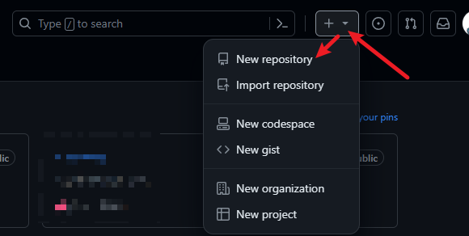
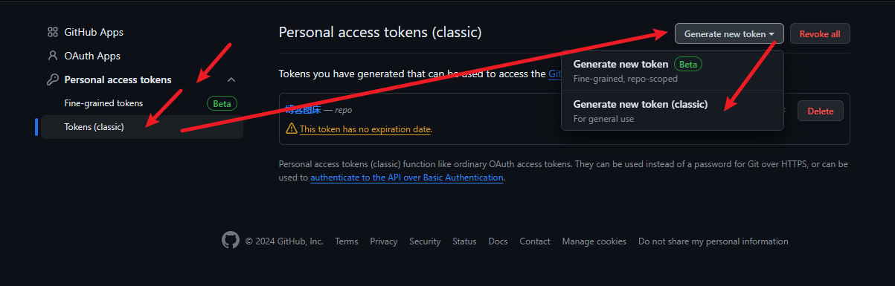
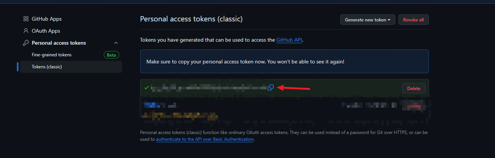

话不多说 ，直接开整！

jsdelivr加速地址：

```typescript
https://cdn.jsdelivr.net/gh/Github用户名/仓库名@master
https://fastly.jsdelivr.net/gh/Github用户名/仓库名@master
```

注意：这两个地址偶尔不好使，自己看哪个好用用哪个。


1. 创建一个GitHub仓库：

​		进入你的GitHub首页，在右上角你会找到一个➕，在下拉菜单中选取"New repository"选项

​	


​	按需填写相关信息，创建仓库：


2. 获取一个GitHub的token用以picgo的身份验证，在你的GitHub主页，右上角点击你的头像，在展示的抽屉中选择"Settings"


然后把左侧选项框滑到最下面，选择"Developer settings"，再从左侧点击"Personal access token"下拉展开，选择"Tokens(classic)"，然后再点击右上角的"Generate new token"，选择"Generate new token(classic)"


按步骤填写信息后，滑倒最下面，创建token，然后复制token值（必须立马复制，否则之后将无法再看到这个token的值）





3. 配置Picgo（下载安装很简单，[官网](https://github.com/Molunerfinn/PicGo/releases) 直接下载安装就行），点击左侧的图床设置，选择github，再点击编辑。


按要求填写内容，点击确定，即可完成配置，可以开始上传图片：

参考：

```
设定仓库名（参考）：MorningM/img-bed
设定自定义域名（参考）：https://cdn.jsdelivr.net/gh/MorningM/img-bed@master
```


到此结束，快去试试吧！
