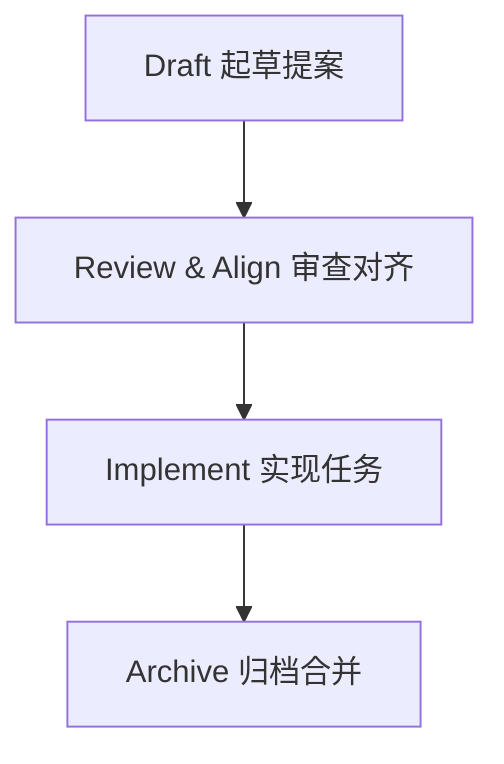

> 当你对 AI 说一句「帮我加个用户管理功能」时，它脑子里浮现的是“通用互联网公司 Demo”；你脑子里浮现的是“本公司 3 年沉淀 + 一堆历史债务”。—— 这就是 Vibe Coding 的鸿沟。

## Vibe Coding：当“凭感觉写代码”遇上 AI

先还原一个大家都心照不宣的场景。

你打开 Cursor / Claude Code / Copilot Chat，敲下：

```text
帮我实现一个用户管理模块，包含增删改查和权限控制。
```

几秒钟后，AI 秒回一坨代码：

- `User` 只有 `id/name/email`
- 权限就是一个 `role === 'admin'` 的 if 判断
- 没有审计日志、没有状态机、也没考虑你项目里的那套 RBAC 体系

你只好接着聊：

- 「再加上用户状态：激活 / 禁用 / 删除。」
- 「权限别乱写，我们是 RBAC，不是简单 role 判断。」
- 「要有批量操作，还要事务，还有限流……」

三轮下来，你发现：

- **需求理解**：AI 是按“常识”猜，而不是按你项目的“现实世界”来写；
- **设计方案**：它永远倾向“最简单能跑”的实现，而不是你想要的系统性方案；
- **任务拆解**：它会帮你把大任务拆成“三板斧”：建模型 → 写 CRUD → 搞个页面，然后把监控、审计、测试、文档、限流、幂等等一切“理所当然”全忘了。

这就是典型的 **Vibe Coding（凭感觉编码）**：

> 你负责「感觉」要干啥，AI 负责「感觉」怎么实现，最后两种感觉凑在一起，变成一场返工盛宴。

问题不是 AI 不聪明，而是：

- **需求没有被结构化**；
- **设计决策没有沉淀**；
- **任务拆解没有标准**。

AI 只能在一堆聊天记录里，拼命猜你真正想要什么。

## Spec Coding：先对齐，再写代码

那有没有一种方式，能在写任何一行代码之前——

- 先说清楚：**要做什么（Requirements）**；
- 再定下来：**怎么做（Design）**；
- 然后拆明白：**分几步做（Tasks）**；
- 最后才是：**让 AI 按规格执行实现**？

这就是 **Spec Coding（规格驱动编码）** 的核心思想。

用一句话概括：

> 先把“这事应该怎么做”写成规格，再让 AI 按规格写代码。

类比一下：

- Vibe Coding：口头跟工人说「帮我盖个三室一厅」，然后对着半成品现场吵架；
- Spec Coding：先画完整建筑图纸，拉一轮 Review，对齐之后再开工。

在实践里，Spec Coding 会把信息拆成三类 **规格（Spec）**：

- **Requirements Spec**：从用户视角描述「系统应该做什么」；
- **Design Spec**：从技术视角描述「系统应该如何实现」；
- **Task Spec**：从执行视角拆分「实现要分几步」。

AI 不再“自由发挥”，而是：

1. 看 **Requirements** 知道边界和业务规则；
2. 看 **Design** 知道架构、数据模型和约束；
3. 看 **Tasks** 知道要按什么顺序动手。

当人和 AI 先在规格层面对齐，后面的实现就从“灵感创作”变成“按图施工”。

## OpenSpec：给 Spec Coding 装上一套「工程骨架」

理念听起来很好，但如果全靠人肉写文档，很快就会变成这样的吐槽：

- 「写规格比写代码累十倍。」
- 「文档三天就过时了，没人再看。」
- 「改个小需求还要跑去更新 Confluence。」

于是就有了 **OpenSpec**：

> 一个为 AI 编程助手（Cursor / Claude Code / Windsurf / Copilot 等）设计的 **规范驱动开发框架**，帮你把 Spec Coding 这套理念真正落地到项目里。

从工程视角看，OpenSpec 提供了几件关键武器：

- **标准目录结构**：把“当前生效的系统规格”和“正在进行的变更”分开管理；
- **四阶段工作流**：Draft → Review → Implement → Archive；
- **与多家 AI 工具深度集成**：通过命令或斜杠指令，让 AI 按规格工作；
- **可追溯的变更历史**：每个功能都有提案、任务清单、规格增量，方便事后复盘。

它既不是一个新的框架，也不是某个云服务，而是一套：

- 放在你项目仓库里的目录；
- 加上一些 CLI 命令；
- 再配合你日常使用的 AI 编辑器，就能跑起来的规范层。

## OpenSpec 的目录结构：`specs` 与 `changes` 的“双轨制”

初始化 OpenSpec 后，项目里会多出一个 `openspec` 目录，大致长这样：

```text
my-project/
└── openspec/
    ├── specs/              # 📋 当前规格（Source of Truth）
    │   ├── requirements/   # 需求规格
    │   ├── design/         # 设计规格
    │   └── api/            # API 规格
    └── changes/            # 🚧 变更提案（进行中的修改）
        └── feature-xxx/
            ├── proposal.md # 变更提案：为什么做、做什么、不做什么
            ├── tasks.md    # 任务清单：分几步做
            └── specs/      # 本次变更的规格增量
                ├── requirements/
                └── design/
```

设计的关键点在于：**规格与变更分离**：

- `specs/`：描述“当前系统应该如何工作”，是整个项目的 **单一真相来源**；
- `changes/`：描述“这次想改什么”，在变更完成并归档之前，不会污染正式规格。

这样带来的好处：

- 未完成的提案不会把规格搞得一团糟；
- 多个改动可以并行推进，各自有独立目录；
- 任何一次变更都能被完整回放：提案 → 规格增量 → 实现任务 → 最终归档。

## 四阶段工作流：从提案到归档

OpenSpec 把一次功能变更，拆成四个清晰阶段：



### 阶段一：Draft——起草提案

目标：**把“要做什么”说清楚，但暂时还不写代码。**

在支持 OpenSpec 的编辑器里，你通常会用类似指令：

```text
/openspec:proposal Post Like Feature
```

然后 AI 不会立刻写代码，而是先跟你确认一堆关键点，例如：

- 点赞是“单一点赞”还是有“喜欢 / 不喜欢”两种状态？
- 是否允许匿名用户点赞？
- 点赞数用啥存：单表？计数器？Redis 缓存？
- 是否有防刷、限流、幂等等要求？

你逐一回答后，AI 会生成一个变更目录，例如：

```text
openspec/changes/post-like-feature/
├── proposal.md        # 本次变更的背景、目标、范围、风险
├── tasks.md           # 1.x 2.x 3.x... 的任务清单
└── specs/
    └── post-like/
        └── spec.md    # 本次新增/修改的需求与设计规格
```

这一步的目标只有一个：**形成一份你看得懂、愿意签字的“施工图纸草稿”。**

### 阶段二：Review & Align——审查与对齐

目标：**让人类先把提案审完，再让 AI 动手。**

这里可以是你自己 Review，也可以拉上同事一起看：

- `proposal.md`：目标是不是清晰？有没有 Out of Scope？有没有风险评估？
- `specs/.../spec.md`：业务规则是否完整？边界条件是否写清楚？
- `tasks.md`：任务拆解是否细到“可执行”？有没有明显遗漏？

如果发现问题，可以直接改文件，也可以让 AI 按自然语言修改：

```text
请在 post-like-feature 的 proposal.md 里补充：
- 高并发下点赞数一致性方案（乐观锁 or 分布式锁）
- Redis 与 DB 不一致时的修复机制（定时校对 + 缓存失效策略）
```

当你觉得“这份规格已经能放心交给任何一个同事/AI 去实现”时，这个阶段就算完成了。

### 阶段三：Implement——按规格实现

目标：**AI 不再猜需求，而是按规格执行任务。**

这一步通常会用到类似命令：

```text
/openspec:apply post-like-feature
```

或更细一点：

```text
/openspec:apply post-like-feature --tasks 1.1,1.2,2.1
```

AI 会按照 `tasks.md` 里的任务清单依次执行：

- 1.1 创建数据库迁移文件；
- 1.2 修改 `posts` 表增加 `likes_count` 字段；
- 2.1 实现 `LikeService.likePost()`；
- 3.1 实现 `POST /api/posts/:postId/like`… 等。

在每个具体任务的 prompt 里，你会明确引用规格：

```text
请实现 Task 2.1: LikeService.likePost()

参考规格：
@openspec/changes/post-like-feature/specs/post-like/spec.md (REQ-LIKE-001)

要求：
- 严格遵守 REQ-LIKE-001 的业务规则（防重复点赞）
- 使用设计文档中定义的数据模型和缓存策略
- 处理并记录所有异常情况，返回统一响应格式
```

AI 此时做的，不再是“发挥想象力”，而是 **执行一份已经通过审核的规格**。

### 阶段四：Archive——归档与合并

目标：**让代码与规格同步增长，而不是渐行渐远。**

当所有任务完成、测试通过，功能已经稳定之后，你会执行类似命令：

```bash
openspec archive post-like-feature
```

CLI 会帮你完成一系列“善后工作”：

1. 把这次变更目录移动到归档区域，记录变更时间与摘要；
2. 根据规格中的 `ADDED/MODIFIED/REMOVED` 标记，把增量合并进 `openspec/specs/`；
3. 更新 `CHANGELOG` 或其它索引，方便后续查阅；
4. 确保 `specs/` 目录始终描述的是「当前系统的真实样子」。

这样一来，你的项目就获得了一套 **“可追溯、可理解、可验证”** 的演进历史，而不是只剩下几句模糊的 Git 提交信息。

## 10 分钟上手 OpenSpec：从 0 到 1 的体验

下面用一个简单场景，快速感受一下 OpenSpec 的上手路径。

### 场景：给博客系统加一个“文章点赞”功能

目标：

- 登录用户可以对文章点赞 / 取消点赞；
- 显示每篇文章的总点赞数；
- 防止重复点赞和简单刷接口；
- 点赞数使用 Redis 做缓存，兼顾性能与一致性。

### 第一步：安装 CLI

```bash
npm install -g @fission-ai/openspec@latest

openspec --version
```

### 第二步：初始化项目

在你的项目根目录执行：

```bash
cd my-blog-project
openspec init
```

CLI 会引导你：

- 选择使用的 AI 工具（Cursor / Claude Code / Windsurf / Copilot 等）；
- 创建 `openspec/` 目录和一些示例文件；
- 生成 `AGENTS.md`，约定好和 AI 协作的使用方式。

### 第三步：创建第一个提案

在支持 OpenSpec 的编辑器里输入：

```text
/openspec:proposal Post Like Feature
```

然后用自然语言把需求补充完整，例如：

```text
为博客文章添加点赞功能，包括：
- 用户可对文章点赞/取消点赞
- 显示文章的总点赞数
- 防止重复点赞
- 使用 Redis 缓存点赞数
- 简单防刷：对单用户做限流（1 秒内最多点赞 1 次）
```

AI 会为你生成：

- `proposal.md`：为什么要做、范围是什么、有什么风险；
- `design.md` / `spec.md`：数据模型（`post_likes` 表、Redis Key 设计）、API 设计、缓存策略；
- `tasks.md`：从数据层 → 业务层 → API → 前端 → 测试的分阶段任务。

### 第四步：Review 提案

仔细阅读这些文件，重点看：

- 业务规则有没有遗漏边界情况（例如“删除文章后点赞如何处理”）；
- 缓存策略是否考虑到 DB 与 Redis 不一致时的修复；
- 任务拆解是否覆盖了监控、日志和测试。

如果不满意，就让 AI 按你的意见修改规格，而不是先修改代码。

### 第五步：按规格实现

当提案通过后，就可以开始按任务驱动 AI：

```text
请实现 Task 1.1 和 1.2：
- 创建 post_likes 表的数据库迁移
- 给 posts 表添加 likes_count 字段

参考：
@openspec/changes/post-like-feature/specs/post-like/spec.md (数据模型部分)
```

接着是业务层、API 层、前端组件、测试……每一步都有规格可查、有任务可勾。

### 第六步：测试并归档

当你本地验证功能一切正常，就可以：

- 跑一遍自动化测试；
- 手动走一遍核心流程；
- 然后执行 `openspec archive post-like-feature` 完成归档。

自此，这个功能不仅“上线了”，还留下了一整套：

- 需求规格；
- 设计规格；
- 任务清单与实现记录；
- 可被后人快速理解和复用的文档。

## 写好 Spec 的几个最佳实践

OpenSpec 解决的是“规格如何管理和驱动 AI”，但**规格本身也有写法的好坏之分**。

### 1. 三层规格：Requirements / Design / Tasks

推荐的粒度控制是：

- **Requirements Spec**：只回答「要做什么」，从用户和业务视角描述；
- **Design Spec**：只回答「怎么做」，从系统和技术视角描述；
- **Task Spec**：只回答「分几步做」，从执行视角拆分任务。

一个简单例子：

- Requirements：`用户可以对文章点赞/取消点赞，每个用户对每篇文章最多点一次赞。`
- Design：`使用 post_likes(post_id, user_id) 存储点赞关系，posts.likes_count 做冗余统计，使用 Redis 缓存计数，定期回写。`
- Tasks：`创建迁移文件 → 实现 LikeService → 实现 API → 实现前端按钮 → 写测试。`

**原则：**

- Requirements 不要写实现细节（比如“用 Redis 存起来”），那是 Design 的事情；
- Design 要具体到 AI 能够据此写出正确代码；
- Tasks 要细到“一个任务可以在一次 AI 交互中 reasonably 完成”。

### 2. 让 AI 精确“按图施工”

当你已经有了规格文件，一定要在 Prompt 里 **显式引用**：

- ❌ 「帮我实现评论功能」—— AI 只能猜；
- ✅ 「请实现 Task 2.1: CommentService.createComment()，参考 @openspec/.../requirements/comment-system.md (REQ-COM-001) 和 @openspec/.../design/comment-architecture.md（数据模型部分）。」

同时，尽量避免“超长大规格文件”：

- 把需求按业务模块拆分：`auth.md` / `user-management.md` / `comment.md`；
- 让每次 AI 交互只关注当前相关的那几个章节。

### 3. 规格不要写成“小说体”

常见误区是：写了很多自然语言故事，但缺少结构化信息。例如：

> 用户输入邮箱和密码，点击注册按钮，系统会检查邮箱是否已经存在，如果不存在就创建用户，然后发一封验证邮件，用户点击之后账号就被激活……

更推荐的写法是：

```markdown
## REQ-USER-REGISTER-001: 用户注册

**前置条件**

- 邮箱未被注册

**输入**

- email, password

**业务规则**

- 邮箱格式校验
- 密码强度：8–32 位，必须包含数字和字母
- 发送验证邮件，链接 24 小时内有效

**输出**

- userId

**异常**

- 邮箱已存在 → 返回 400 + 错误码 `EMAIL_EXISTS`
```

**关键是：让 AI 能“快速 parse 出关键约束”，而不是读完一篇散文。**

### 4. 时时记得：代码变了，规格也要变

规格一旦和代码脱节，很快就会演变成：

- 新人只敢看代码，不敢看文档；
- AI 只敢信“最新聊天记录”，不再信 `openspec/specs`。

解决办法不是“期望大家自觉”，而是：

- 在 Code Review 模板里加一条检查：**是否同步更新了相关规格文件**；
- 使用 pre-commit 或 CI 检查：涉及核心模块的代码变更时，是否也改了 `openspec/specs`。

## 什么时候该上 OpenSpec，什么时候可以算了？

**适合上的场景：**

- 中大型功能开发，涉及多个模块，质量要求高；
- 长期演进的业务系统，需要给未来的自己/同事留条活路；
- 多人协作项目，接口多、边界多、历史包袱多；
- 正在大量使用 AI 编程助手，希望“可控性”和“可追溯性”大幅提升。

**不太适合的场景：**

- 临时验证一个想法的快速 Demo；
- 一次性脚本、小工具；
- 改一行 typo 或小 Bug，不涉及设计层面的变更；
- 需求本身还模糊到“连人都没想清楚要啥”的阶段。

一句话总结：

> **OpenSpec 更像是“团队级生产工具”，而不是“周末写脚本的小玩具”。**

## 总结：从“凭感觉”到“有规格”只差一步

如果把 AI 编程比作开车：

- 纯 Vibe Coding 就像是“把方向盘交给一个很会开车、但没听清你要去哪里的老司机”；
- OpenSpec + Spec Coding 则是：**先把目的地、路线和中途停靠站写进导航，再让司机开。**

最后给一个可以直接落地的小行动清单：

- 在你的主要项目里装上 `@fission-ai/openspec` 并 `openspec init`；
- 选一个“小而完整”的功能，用 `/openspec:proposal` 走一遍四阶段工作流；
- 把本篇提到的三层规格、引用习惯、Review 清单真正用起来；
- 等体验到“返工明显变少、代码质量和沟通效率明显变高”之后，再考虑把它推广到更多模块。

参考阅读：

- OpenSpec 官网：`https://openspec.dev`
- OpenSpec GitHub：`https://github.com/Fission-AI/OpenSpec`
