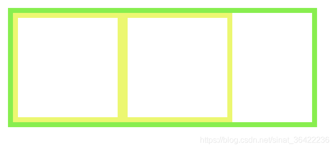

#### 什么是BFC

​		BFC 全称为块级格式化上下文 (Block Formatting Context) 。BFC是 W3C CSS 2.1 规范中的一个概念，它决定了元素如何对其内容进行定位以及与其他元素的关系和相互作用，当涉及到可视化布局的时候，Block Formatting Context提供了一个环境，HTML元素在这个环境中按照一定规则进行布局。一个环境中的元素不会影响到其它环境中的布局。比如浮动元素会形成BFC，浮动元素内部子元素的主要受该浮动元素影响，两个浮动元素之间是互不影响的。这里有点类似一个BFC就是一个独立的行政单位的意思。可以说BFC就是一个作用范围，把它理解成是一个独立的容器，并且这个容器里box的布局与这个容器外的box毫不相干。

#### 触发BFC的条件

- 根元素或其它包含它的元素
- 浮动元素 (元素的 `float` 不是 `none`)
- 绝对定位元素 (元素具有 `position` 为 `absolute` 或 `fixed`)
- 内联块 (元素具有 `display: inline-block`)
- 表格单元格 (元素具有 `display: table-cell`，HTML表格单元格默认属性)
- 表格标题 (元素具有 `display: table-caption`, HTML表格标题默认属性)
- 具有`overflow` 且值不是 `visible` 的块元素
- 弹性盒（`flex`或`inline-flex`）
- `display: flow-root`
- `column-span: all`

#### BFC的约束规则

- 内部的盒会在垂直方向一个接一个排列（可以看作BFC中有一个的常规流）
- 处于同一个BFC中的元素相互影响，可能会发生外边距重叠
- 每个元素的margin box的左边，与容器块border box的左边相接触(对于从左往右的格式化，否则相反)，即使存在浮动也是如此
- BFC就是页面上的一个隔离的独立容器，容器里面的子元素不会影响到外面的元素，反之亦然
- 计算BFC的高度时，考虑BFC所包含的所有元素，连浮动元素也参与计算
- 浮动盒区域不叠加到BFC上

#### BFC可以解决的问题

- 垂直外边距重叠问题
- 去除浮动
- 自适用两列布局（`float` + `overflow`）


### BFC的作用

###### 1.利用BFC避免margin重叠。

一起来看一个例子：

```
<!DOCTYPE html>
<html lang="en">
<head>
    <meta charset="UTF-8">
    <meta name="viewport" content="width=device-width, initial-scale=1.0">
    <meta http-equiv="X-UA-Compatible" content="ie=edge">
    <title>防止margin重叠</title>
</head>
<style>
    *{
        margin: 0;
        padding: 0;
    }
    p {
        color: #f55;
        background: yellow;
        width: 200px;
        line-height: 100px;
        text-align:center;
        margin: 30px;
    }
</style>
<body>
    <p>看看我的 margin是多少</p>
    <p>看看我的 margin是多少</p>
</body>
</html>

```

页面生成的效果就是这样的：


根据第二条，属于同一个BFC的两个相邻的Box会发生margin重叠，所以我们可以设置，两个不同的BFC，也就是我们可以让把第二个p用div包起来，然后激活它使其成为一个BFC

```
<!DOCTYPE html>
<html lang="en">
<head>
    <meta charset="UTF-8">
    <meta name="viewport" content="width=device-width, initial-scale=1.0">
    <meta http-equiv="X-UA-Compatible" content="ie=edge">
    <title>防止margin重叠</title>
</head>
<style>
    *{
        margin: 0;
        padding: 0;
    }
    p {
        color: #f55;
        background: yellow;
        width: 200px;
        line-height: 100px;
        text-align:center;
        margin: 30px;
    }
    div{
        overflow: hidden;
    }
</style>
<body>
    <p>看看我的 margin是多少</p>
    <div>
        <p>看看我的 margin是多少</p>
    </div>
</body>
</html>

```


###### 2.自适应两栏布局

根据：

- 每个盒子的margin box的左边，与包含块border box的左边相接触(对于从左往右的格式化，否则相反)。即使存在浮动也是如此。


```
<!DOCTYPE html>
<html lang="en">
<head>
    <meta charset="UTF-8">
    <meta name="viewport" content="width=device-width, initial-scale=1.0">
    <meta http-equiv="X-UA-Compatible" content="ie=edge">
    <title>Document</title>
</head>
<style>
    *{
        margin: 0;
        padding: 0;
    }
    body {
        width: 100%;
        position: relative;
    }
 
    .left {
        width: 100px;
        height: 150px;
        float: left;
        background: rgb(139, 214, 78);
        text-align: center;
        line-height: 150px;
        font-size: 20px;
    }
 
    .right {
        height: 300px;
        background: rgb(170, 54, 236);
        text-align: center;
        line-height: 300px;
        font-size: 40px;
    }
</style>
<body>
    <div class="left">LEFT</div>
    <div class="right">RIGHT</div>
</body>
</html>

```


又因为：

- BFC的区域不会与float box重叠。

所以我们让right单独成为一个BFC

```
<!DOCTYPE html>
<html lang="en">
<head>
    <meta charset="UTF-8">
    <meta name="viewport" content="width=device-width, initial-scale=1.0">
    <meta http-equiv="X-UA-Compatible" content="ie=edge">
    <title>Document</title>
</head>
<style>
    *{
        margin: 0;
        padding: 0;
    }
    body {
        width: 100%;
        position: relative;
    }
 
    .left {
        width: 100px;
        height: 150px;
        float: left;
        background: rgb(139, 214, 78);
        text-align: center;
        line-height: 150px;
        font-size: 20px;
    }
 
    .right {
        overflow: hidden;
        height: 300px;
        background: rgb(170, 54, 236);
        text-align: center;
        line-height: 300px;
        font-size: 40px;
    }
</style>
<body>
    <div class="left">LEFT</div>
    <div class="right">RIGHT</div>
</body>
</html>

```


right会自动的适应宽度，这时候就形成了一个两栏自适应的布局。

###### 3.清楚浮动。

当我们不给父节点设置高度，子节点设置浮动的时候，会发生高度塌陷，这个时候我们就要清楚浮动。

比如这样：

```
<!DOCTYPE html>
<html lang="en">
<head>
    <meta charset="UTF-8">
    <meta name="viewport" content="width=device-width, initial-scale=1.0">
    <meta http-equiv="X-UA-Compatible" content="ie=edge">
    <title>清除浮动</title>
</head>
<style>
    .par {
        border: 5px solid rgb(91, 243, 30);
        width: 300px;
    }
    
    .child {
        border: 5px solid rgb(233, 250, 84);
        width:100px;
        height: 100px;
        float: left;
    }
</style>
<body>
    <div class="par">
        <div class="child"></div>
        <div class="child"></div>
    </div>
</body>
</html>

```


这个时候我们根据最后一条：

- 计算BFC的高度时，浮动元素也参与计算。

给父节点激活BFC

```
<!DOCTYPE html>
<html lang="en">
<head>
    <meta charset="UTF-8">
    <meta name="viewport" content="width=device-width, initial-scale=1.0">
    <meta http-equiv="X-UA-Compatible" content="ie=edge">
    <title>清除浮动</title>
</head>
<style>
    .par {
        border: 5px solid rgb(91, 243, 30);
        width: 300px;
        overflow: hidden;
    }
    
    .child {
        border: 5px solid rgb(233, 250, 84);
        width:100px;
        height: 100px;
        float: left;
    }
</style>
<body>
    <div class="par">
        <div class="child"></div>
        <div class="child"></div>
    </div>
</body>
</html>

```



总结
以上例子都体现了：

BFC就是页面上的一个隔离的独立容器，容器里面的子元素不会影响到外面的元素。反之也如此。

因为BFC内部的元素和外部的元素绝对不会互相影响，因此， 当BFC外部存在浮动时，它不应该影响BFC内部Box的布局，BFC会通过变窄，而不与浮动有重叠。同样的，当BFC内部有浮动时，为了不影响外部元素的布局，BFC计算高度时会包括浮动的高度。避免margin重叠也是这样的一个道理。
————————————————
版权声明：本文为CSDN博主「Leon_94」的原创文章，遵循CC 4.0 BY-SA版权协议，转载请附上原文出处链接及本声明。
原文链接：https://blog.csdn.net/sinat_36422236/article/details/88763187

