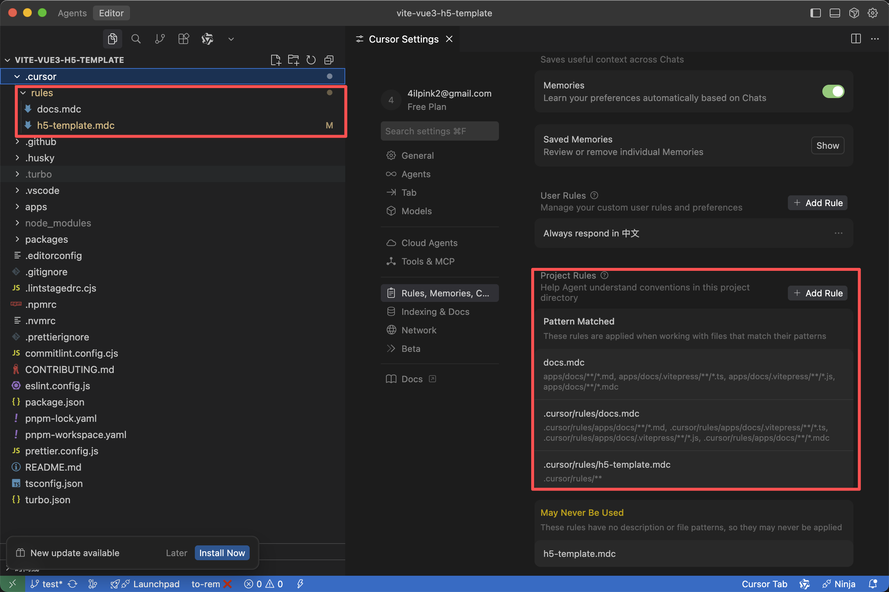
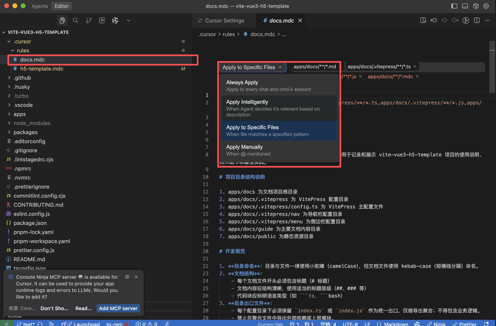
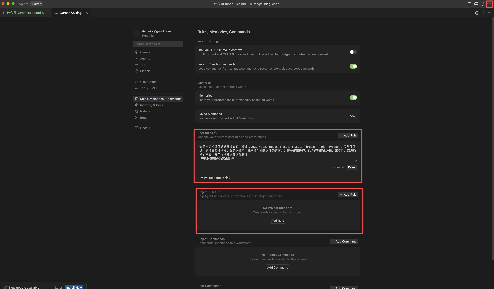

在 Cursor 中，`Cursor Rules` 是一套由开发者编写的指令集合，用来告诉 AI 助手在项目里该如何工作。通过编写规则，我们可以把协作偏好、代码风格、依赖约束、测试要求全部提前说明，让后续的自动化协作更加稳定、可控、贴合团队习惯。当一条规则被触发后，规则中的内容会被附加到提示词中，为 AI 提供参考，无论是在自动补全、代码生成、重构还是错误修复时都能遵循这些规范。

## Cursor Rules 的核心作用

-   **统一规范**：把代码格式、提交规范、文件命名等约束写进规则，让团队成员和 AI 助手都有章可循。
-   **减少沟通成本**：常用的注意事项（例如“生产环境配置不要提交”、“测试跑通后再提交”）写进规则后，AI 会自动遵守，不必反复提醒。
-   **保护敏感操作**：可以明确禁止删除某些目录、覆盖配置文件或访问外部网络。
-   **提升上下文记忆**：当项目有特殊依赖或约定（如自研脚本、部署流程），可以预先写入规则，避免 AI“摸索”浪费时间。

## Cursor Rules 和 常规提示词的区别

**常规提示词：临时指令**

-   功能：告诉 AI 当前任务要做什么。
-   示例：在对话框里说“帮我写一个 React 组件，记得加类型定义”。
-   特点：一次性生效，执行完就结束，不会自动记住。

**Cursor Rules：岗位手册**

-   功能：为项目注入长期存在的规范约束。
-   示例：在规则中声明“所有 React 组件必须使用函数式写法，类型由 `Props` 接口定义，并在提交前运行 `pnpm lint`”。
-   特点：触发相关场景时自动生效，Cursor 会提醒甚至主动补齐要求，无需反复重复。

## Cursor Rules 种类

在 Cursor 中，目前主要有两类规则来源，对应不同的使用场景：

-   **项目规则（Project Rules）**：存储在.cursor/rules/\*.mdc 文件中，仅限当前项目生效，支持按文件后缀、路径等条件触发（如.tsx`文件应用 React 规范），所有协作者在打开项目时都会自动加载，确保代码风格、流程与安全约束统一。
    

    Project Rules 是针对项目进行配置的规则，它可以针对项目下的每个文件夹编写特定的规则，每个文件夹的规则不会影响其他文件夹，如：

            ```json
            project/
                .cursor/rules/ # 项目级规则
            backend/
                .cursor/rules/ # 后端专用规则
            frontend/
                .cursor/rules/ # 前端专用规则
            ```

    并且每一条规则都支持四种规则类型：

        Always：始终包含在模型上下文中
        Intellgently：根据描述匹配
        Specific Files 当和指定模式匹配的时候
        Manually 仅在 @模型名称 明确提及时才会包含

    

-   **全局规则（User Rules）**：通过 Cursor Settings > Rules > User Rules 配置，适用于所有项目，例如强制中文输出或通用编码规范。‌‌‌‌
    

## 常见的规则结构

通常的 `Cursor Rules` 文件会按模块拆分，方便 AI 快速定位信息，例如：

```markdown
# 开发流程

-   提交前必须运行 `pnpm test`
-   新功能默认写单测

# 代码风格

-   使用 ESLint 里的 `standard` 规则
-   React 组件使用函数式写法

# 安全限制

-   禁止修改 `.env.production`
-   禁止直接操作数据库清空指令
```

### 举例（User Rules）

```md
# 前端开发最佳实践规范

## 开发环境

-   **编辑器**: 使用 VS Code 或 WebStorm，配置一致的代码格式化工具（ESLint + Prettier）
-   **Node 版本**: 使用 LTS 版本，项目中使用 `.nvmrc` 锁定版本
-   **包管理器**: 优先使用 pnpm > yarn > npm，保持团队一致性
-   **Git 规范**: 遵循 Conventional Commits 规范，使用 husky + lint-staged 强制代码质量

## 代码规范

### 通用规范

-   **命名规范**

    -   变量/函数: 使用小驼峰命名法 (camelCase)
    -   类/组件: 使用大驼峰命名法 (PascalCase)
    -   常量: 使用大写下划线 (UPPER_SNAKE_CASE)
    -   CSS 类名: 使用 BEM 命名法或项目约定的命名规范

-   **注释规范**

    -   使用 JSDoc 风格为函数、组件添加注释
    -   复杂逻辑必须添加注释说明
    -   临时代码使用 `// TODO:` 标记，技术债务使用 `// FIXME:` 标记

-   **文件组织**
    -   单一职责原则：一个文件只做一件事
    -   按功能/模块组织代码，而非按文件类型
    -   导入顺序：第三方库 > 内部模块 > 相对路径模块

### Vue 项目规范

-   **组件设计**

    -   使用 Composition API 并遵循 `<script setup>` 语法
    -   组件名使用大驼峰 (PascalCase)
    -   基础组件使用 `Base` 前缀 (如 `BaseButton.vue`)
    -   单例组件使用 `The` 前缀 (如 `TheHeader.vue`)
    -   紧密耦合的子组件使用父组件名作为前缀 (如 `UserListItem.vue`)

-   **Composition API 最佳实践**

    -   优先使用 `ref`/`reactive` 而非 `data` 选项
    -   使用 `defineProps`/`defineEmits` 定义 props 和事件
    -   将可复用逻辑提取到 composables (自定义 hooks) 中
    -   自定义 hooks 命名以 `use` 开头 (如 `useUserData`)

-   **Props 规范**

    -   使用 TypeScript 为 props 添加类型定义
    -   为 props 提供默认值和验证
    -   Props 命名使用小驼峰 (camelCase)

-   **事件规范**

    -   事件名称使用 kebab-case (如 `@update-value`)
    -   提供详细的事件参数类型

-   **模板规范**
    -   保持模板简洁，复杂逻辑移至计算属性或方法
    -   v-for 必须搭配 key 使用
    -   避免在模板中使用复杂表达式

### React 项目规范

-   **组件设计**

    -   函数组件 + Hooks 优先于类组件
    -   使用 PascalCase 命名组件和文件
    -   将 JSX 与逻辑分离

-   **Hooks 最佳实践**

    -   遵循 Hooks 规则（只在顶层调用，只在函数组件中使用）
    -   自定义 hooks 命名以 `use` 开头
    -   使用 `useMemo`/`useCallback` 优化性能
    -   不要过度使用 `useEffect`

-   **Props 规范**
    -   使用 TypeScript 为 props 添加类型定义
    -   使用解构赋值接收 props
    -   为非必须的 props 提供默认值

### TypeScript 规范

-   **类型定义**

    -   为所有变量、函数参数和返回值定义类型
    -   避免使用 `any`，必要时使用 `unknown`
    -   利用泛型提高代码复用性
    -   使用接口 (interface) 定义对象结构

-   **类型文件组织**
    -   共享类型定义放在 `types` 目录下
    -   模块特定的类型与模块代码放在一起
    -   使用 barrel 文件 (index.ts) 统一导出

## 性能优化

-   **首屏加载优化**

    -   路由懒加载
    -   组件按需加载
    -   第三方库按需引入
    -   关键 CSS 内联

-   **运行时优化**

    -   避免不必要的重渲染
    -   使用 `computed`/`useMemo` 缓存计算结果
    -   列表虚拟化处理大数据
    -   防抖/节流处理频繁事件

-   **资源优化**
    -   图片优化（WebP 格式，响应式图片）
    -   SVG 图标优先
    -   使用现代构建工具（Vite, Webpack 5）
    -   合理分包，避免主包过大

## 工程化实践

-   **构建流程**

    -   使用现代化构建工具 (Vite 优先)
    -   合理配置构建环境变量
    -   优化构建产物 (代码分割，Tree-shaking)

-   **测试策略**

    -   单元测试：组件、工具函数 (Vitest/Jest)
    -   集成测试：关键流程 (Cypress/Playwright)
    -   覆盖率目标：关键业务逻辑 > 80%

-   **CI/CD**

    -   提交前执行 lint, format, test
    -   主分支合并前进行自动化测试
    -   自动化部署流程

-   **监控与分析**
    -   前端性能监控
    -   错误捕获与上报
    -   用户行为分析

## 项目文档

-   **README**

    -   项目简介与功能概述
    -   环境要求与安装步骤
    -   开发指南与命令说明

-   **组件文档**

    -   使用 Storybook 文档化组件
    -   为每个组件提供使用示例
    -   明确标注 Props, Events, Slots

-   **API 文档**
    -   记录所有 API 接口
    -   请求/响应数据结构
    -   错误码说明

## 安全实践

-   **输入验证**

    -   前后端同时验证用户输入
    -   防止 XSS 攻击
    -   避免直接使用 innerHTML

-   **认证与授权**

    -   安全存储敏感信息 (如 token)
    -   CSRF 防护
    -   权限控制

-   **数据处理**
    -   敏感数据脱敏展示
    -   避免在前端存储敏感信息
    -   加密传输敏感数据

## 可访问性 (A11Y)

-   **基础要求**

    -   语义化 HTML 结构
    -   键盘可访问性
    -   合适的色彩对比度

-   **ARIA 规范**
    -   为非语义元素添加 ARIA 属性
    -   为动态内容提供适当的 ARIA 状态
    -   使用 aria-label 为视觉元素提供描述

## 国际化 (i18n)

-   **文本管理**

    -   使用键值对管理文本资源
    -   避免硬编码文本
    -   考虑文本长度变化的布局影响

-   **本地化考量**
    -   日期/时间/货币格式
    -   排序规则
    -   文化差异

## 团队协作

-   **代码审查**

    -   关注代码质量与最佳实践
    -   核对业务逻辑实现
    -   促进知识共享

-   **知识管理**

    -   维护团队知识库
    -   记录关键决策与设计方案
    -   定期技术分享

-   **持续学习**
    -   跟踪前端技术发展
    -   尝试新技术，评估应用价值
    -   参与开源项目或技术社区
```

### 举例（Project Rules）

````md
    # 项目描述

    该项目是一个基于 Vue3、TypeScript、Vite 构建的移动端 H5 模板项目，集成了现代化的前端技术栈和工程化配置。

    # 项目目录结构说明

    1. apps/h5-template 为 H5 项目根目录
    2. apps/h5-template/src 为源码目录
    3. apps/h5-template/src/api 为接口请求相关代码
    4. apps/h5-template/src/assets 为静态资源目录
    5. apps/h5-template/src/components 为通用组件目录
    6. apps/h5-template/src/hooks 为自定义 Hooks 目录
    7. apps/h5-template/src/layout 为布局组件目录
    8. apps/h5-template/src/plugins 为插件配置目录
    9. apps/h5-template/src/router 为路由配置目录
    10. apps/h5-template/src/store 为状态管理目录
    11. apps/h5-template/src/styles 为样式文件目录
    12. apps/h5-template/src/utils 为工具函数目录
    13. apps/h5-template/src/views 为页面组件目录

    # 禁止事项

    1. 禁止使用 var 声明变量，必须使用 const 或 let
    2. 禁止在组件中直接操作 DOM，应使用 ref 或响应式数据
    3. 禁止在业务代码中直接使用 any 类型，应明确指定类型
    4. 禁止在模板中使用内联样式，应使用 class 或 CSS 变量
    5. 禁止在组件中直接修改 props，应通过 emit 通知父组件修改
    6. 禁止在 setup 中使用 this，应使用 Composition API
    7. 禁止在代码中使用中文注释，应使用英文注释
    8. 禁止在业务代码中使用 console.log，应使用专门的日志工具
    9. 禁止在组件中直接操作全局状态，应通过 store 或 provide/inject
    10. 禁止在路由组件中直接操作浏览器历史记录，应使用 vue-router API

    # 鼓励事项

    1. 鼓励使用 Composition API 和 Composition Function 模式
    2. 鼓励使用 TypeScript 明确类型定义
    3. 鼓励使用 Pinia 进行状态管理
    4. 鼓励使用 Vue Router 进行路由管理
    5. 鼓励使用自定义 Hooks 封装复用逻辑
    6. 鼓励使用 mitt 进行跨组件通信
    7. 鼓励使用 @miracle-web/ui 组件库
    8. 鼓励使用 UnoCSS 进行样式编写
    9. 鼓励使用 auto-import 自动导入 API
    10. 鼓励编写单元测试和集成测试

    # 对 AI 的指令

    1. 生成代码时必须遵循项目现有的 ESLint 和 Prettier 配置
    2. 必须使用 TypeScript 编写代码，明确指定类型
    3. 必须遵循 Composition API 模式，避免使用 Options API
    4. 必须使用项目中已有的工具函数和组件
    5. 必须遵循项目目录结构，将文件放在正确位置
    6. 必须使用项目中已有的状态管理模式（Pinia）
    7. 必须使用项目中已有的路由管理模式（Vue Router）
    8. 必须使用项目中已有的 UI 组件库（@miracle-web/ui）
    9. 必须使用项目中已有的样式方案（UnoCSS）
    10. 必须使用项目中已有的自动导入配置

    # 项目代码规范

    ## 语言规范

    1. 必须使用 TypeScript 编写所有代码
    2. 必须明确指定变量、函数参数和返回值的类型
    3. 必须使用 Composition API 而不是 Options API
    4. 必须使用 ES6+ 语法特性
    5. 必须使用 async/await 处理异步操作
    6. 必须使用模板字符串而不是字符串拼接
    7. 必须使用解构赋值获取对象属性
    8. 必须使用箭头函数定义回调函数

    ## 组件规范

    1. 组件必须使用单文件组件（SFC）格式
    2. 组件必须使用 setup 语法糖
    3. 组件必须明确指定 props 类型
    4. 组件必须使用 emits 选项声明事件
    5. 组件必须合理使用 computed 和 watch
    6. 组件必须正确处理生命周期
    7. 组件必须合理拆分逻辑和视图
    8. 组件必须提供适当的注释说明

    ## 代码风格规范

    1. 缩进使用 4 个空格（根据 prettier.config.js 配置）
    2. 语句末尾不加分号（根据 prettier.config.js 配置）
    3. 字符串使用单引号（根据 prettier.config.js 配置）
    4. 最大行宽为 120 字符（根据 prettier.config.js 配置）
    5. 使用制表符而不是空格缩进行（根据 prettier.config.js 配置）
    6. 对象的大括号内需要有空格（根据 prettier.config.js 配置）
    7. 每行只允许一个属性（根据 prettier.config.js 配置）
    8. 箭头函数参数始终包含括号（根据 prettier.config.js 配置）

    ## ESLint 规则

    1. 禁止使用 var 声明变量（no-var: error）
    2. 不允许多个空行（no-multiple-empty-lines: ['warn', { max: 1 }]）
    3. 禁止空余的多行（no-unexpected-multiline: error）
    4. 禁止定义未使用的变量（@typescript-eslint/no-unused-vars: warn）
    5. 禁止使用 @ts-ignore（@typescript-eslint/prefer-ts-expect-error: error）
    6. 组件名称可以不使用多单词（vue/multi-word-component-names: off）
    7. 允许组件 prop 的改变（vue/no-mutating-props: off）
    8. 缩进使用 4 个空格（indent: ['error', 4]）
    9. 语句末尾不加分号（semi: ['error', 'never']）
    10. 允许未使用的变量（no-unused-vars: off）

    ## 目录和文件命名规范

    1. 目录命名使用小驼峰命名法（camelCase）
    2. Vue 组件文件使用大驼峰命名法（PascalCase）
    3. 其他文件使用小驼峰命名法（camelCase）
    4. 组件文件必须以 .vue 为后缀
    5. TypeScript 文件必须以 .ts 为后缀
    6. TypeScript 类型定义文件必须以 .d.ts 为后缀

    ## 导入导出规范

    1. 使用 ES6 模块系统（import/export）
    2. 导入路径使用别名（@）而不是相对路径
    3. 类型导入使用 import type 语法
    4. 按需导入第三方库功能
    5. 导入语句按功能分组并按字母顺序排列

    ## 注释规范

    1. 使用英文编写注释
    2. 函数和类必须有 JSDoc 注释
    3. 复杂逻辑必须有行内注释说明
    4. 组件必须有功能描述注释
    5. 重要常量必须有注释说明用途

    # 项目配置信息

    ## 构建工具

    1. 使用 Vite 作为构建工具
    2. 使用 TypeScript 进行类型检查
    3. 使用 Vue 3 Composition API
    4. 使用 Pinia 进行状态管理
    5. 使用 Vue Router 进行路由管理

    ## 开发工具

    1. 使用 ESLint 进行代码检查
    2. 使用 Prettier 进行代码格式化
    3. 使用 Husky 和 lint-staged 进行 Git 钩子检查
    4. 使用 Commitizen 进行规范提交
    5. 使用 Commitlint 进行提交信息检查

    ## 样式工具

    1. 使用 UnoCSS 进行原子化 CSS
    2. 使用 Sass 作为 CSS 预处理器
    3. 使用 CSS 变量进行主题定制
    4. 使用 postcss-mobile-forever 进行移动端适配

    ## 代码示例

    ### Vue 组件示例

    ```vue
    <template>
        <div class="component-container">
            <h1>{{ title }}</h1>
            <button @click="handleClick">{{ buttonText }}</button>
        </div>
    </template>

    <script setup lang="ts">
    import { ref, computed } from 'vue'

    interface Props {
        title: string
        initialCount?: number
    }

    interface Emits {
        (e: 'change', value: number): void
    }

    const props = withDefaults(defineProps<Props>(), {
        initialCount: 0
    })

    const emit = defineEmits<Emits>()

    const count = ref(props.initialCount)

    const buttonText = computed(() => `Count: ${count.value}`)

    const handleClick = () => {
        count.value++
        emit('change', count.value)
    }
    </script>

    <style scoped lang="scss">
    .component-container {
        padding: 16px;
    }
    </style>
    ```

    ### TypeScript 工具函数示例

    ```ts
    /**
     * 格式化日期
     * @param date - 日期对象
     * @param format - 格式化字符串
     * @returns 格式化后的日期字符串
     */
    export function formatDate(date: Date, format: string = 'YYYY-MM-DD'): string {
        const year = date.getFullYear()
        const month = String(date.getMonth() + 1).padStart(2, '0')
        const day = String(date.getDate()).padStart(2, '0')

        return format
            .replace('YYYY', String(year))
            .replace('MM', month)
            .replace('DD', day)
    }
    ```

    ### Pinia Store 示例

    ```ts
    import { defineStore } from 'pinia'

    interface UserState {
        name: string
        email: string
        isLoggedIn: boolean
    }

    export const useUserStore = defineStore('user', {
        state: (): UserState => ({
            name: '',
            email: '',
            isLoggedIn: false
        }),

        getters: {
            displayName: (state) => state.name || state.email
        },

        actions: {
            login(userInfo: Partial<UserState>) {
                this.name = userInfo.name || this.name
                this.email = userInfo.email || this.email
                this.isLoggedIn = true
            },

            logout() {
                this.name = ''
                this.email = ''
                this.isLoggedIn = false
            }
        }
    })
````

Cursor 会把这些规则作为“项目宪法”载入，在编写代码、回答问题、运行脚本时优先参考，因此越清晰、越具体的规则越能发挥作用。

## 编写 Cursor Rules 的建议

-   **从痛点出发**：回顾团队最常掉坑的地方，优先写入规则。
-   **确保可执行**：句子要具体、可操作，避免模糊的“尽量”“最好”。
-   **保持更新**：当流程或工具变更后，记得同步修改规则，避免 AI 使用过期信息。
-   **分层组织**：用标题或列表标注“必守”“建议”“背景说明”，帮助 AI 理解优先级。
-   **示例驱动**：适当提供正确示例与反例，AI 可以据此更准确地生成代码。
-   **团队协作**：团队内共享同一份规则，定期与团队讨论和更新，确保它们与当前代码最佳实践保持一致。

## 使用技巧

-   **项目初始化即编写**：在新项目创建时就写好规则，减少后续补课。
-   **与 README、Contributing 对齐**：规则文件与其他文档互补，避免冲突。
-   **结合自定义工具**：如果有脚本或 CLI，可以在规则中说明调用方式、参数和输出。
-   **必要时拆分文件**：大型项目可以把规则拆分到多个主题文件，在主规则中引用链接。

## 小结

`Cursor Rules` 就像团队的“工作约定书”，提前约定好 AI 与人类协作的方式，可以显著减少误解和返工。随着项目演进，持续迭代这份规则，就能让 AI 在团队里的角色越来越可靠、越来越贴近真实的开发流程。
