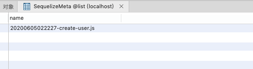
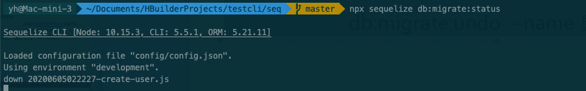

1. ### 安装

  sequelize-cli 的依赖是 sequelize  sequelize的依赖是mysql2 需要自己手动安装

  ```javascript
  npm i sequelize-cli --save-dev
  npm i sequelize
  npm i mysql2
  ```

  查看版本

  ```javascript
  npx sequelize-cli --version
  npx sequelize --version
  ```

  查看所有命令

  ```
  npx sequelize --help
  ```

  ```javascript
  Sequelize CLI [Node: 10.21.0, CLI: 6.0.0, ORM: 6.1.0]
  
  sequelize <指令>
  
  指令：
    带db的都是操作数据库的指令
    sequelize db:migrate                        运行待处理的迁移
    sequelize db:migrate:schema:timestamps:add  更新迁移表以包含时间戳
    sequelize db:migrate:status                 显示所有迁移的状态
    sequelize db:migrate:undo                   撤销一个迁移
    sequelize db:migrate:undo:all               撤销所有执行过的迁移
    sequelize db:seed                           执行指定的种子器
    sequelize db:seed:undo                      从数据库删除数据
    sequelize db:seed:all                       运行所有种子器
    sequelize db:seed:undo:all                  从数据库删除数据
    sequelize db:create                         创建配置指定的数据库
    sequelize db:drop                           删除配置指定的数据库
    带init的都是初始化操作
    sequelize init                              初始化项目
    sequelize init:config                       初始化配置
    sequelize init:migrations                   初始化迁移
    sequelize init:models                       初始化模型
    sequelize init:seeders                      初始化种子器
    后面三种属于生成 创建模型·迁移文件·种子文件的
    sequelize migration:generate                生成新的迁移文件            [别名：migration:create]
    sequelize model:generate                    生成模型及其迁移             [别名：model:create]
    sequelize seed:generate                     生成新的种子文件              [别名：seed:create]
  
  选项：
    --version  显示版本号                                                       [布尔值]
    --help     显示帮助信息                                                     [布尔值]
  
  请输入一个指令
  ```


2. ### 初始化

```javascript
sequelize init
```

初始化sequelize项目，该命令将创建如下目录：             

- config：包含配置文件，它告诉CLI如何连接数据库             
- models：包含您的项目的所有模型           
 - migrations：包含所有迁移文件 （数据表结构）           
 - seeders：包含所有种子文件 （具体数据）

config目录下的config.json数据库配置文件

```javascript
{
  "development": {
    "username": "root",
    "password": "123456",
    "database": "list",
    "host": "127.0.0.1",
    "dialect": "mysql",
    "operatorsAliases": false
  },
  "test": {
    "username": "root",
    "password": null,
    "database": "database_test",
    "host": "127.0.0.1",
    "dialect": "mysql",
    "operatorsAliases": false
  },
  "production": {
    "username": "root",
    "password": null,
    "database": "database_production",
    "host": "127.0.0.1",
    "dialect": "mysql",
    "operatorsAliases": false
  }
}
```

配置在不同环境下数据库连接和密码 dialect 是你要操作的数据库类型，当前我使用的是mysql 也就是说sequelize支持什么数据库他就支持啥数据库, 默认当前环境为开发环境.


3. ### 创建数据库和删除数据库

   ```
   npx sequelize db:create
   ```

   执行命令会根据config.json 中添加的数据名称创建数据库

   ```
   npx sequelize db:drop list
   ```

   执行命令会删除数据库

   

4. ### 创建模型文件 model

    model:generate / model:create        

   创建一个模型文件        

   -- name：模型名称，必须        

   -- attributes：字段列表，必须    

   新建一个表名为user 字段有username 和sex的表模型，运行以下命令：

   ```shell
   npx sequelize model:generate --name user --attributes username:string,sex:string
   ```

   \- 在 models 文件夹中创建了一个 user 模型文件（供程序使用）        

   \- 在 migrations 文件夹中创建了一个名字像 xxxxxxxx-create-user.js 的迁移文件（供迁移使用）

   

   models/user.js文件

   ```js
   'use strict';
   module.exports = (sequelize, DataTypes) => {
     const user = sequelize.define('user', {
       username: DataTypes.STRING,
       sex: DataTypes.STRING
     }, {});
     user.associate = function(models) {
       // associations can be defined here
     };
     return user;
   };
   ```

   migrations/ xxxxxxxx-create-user.js迁移文件

   ```js
   'use strict';
   module.exports = {
     up: (queryInterface, Sequelize) => {
       return queryInterface.createTable('users', {
         id: {
           allowNull: false,
           autoIncrement: true,
           primaryKey: true,
           type: Sequelize.INTEGER
         },
         username: {
           type: Sequelize.STRING
         },
         sex: {
           type: Sequelize.STRING
         },
         createdAt: {
           allowNull: false,
           type: Sequelize.DATE
         },
         updatedAt: {
           allowNull: false,
           type: Sequelize.DATE
         }
       });
     },
     down: (queryInterface, Sequelize) => {
       return queryInterface.dropTable('users');
     }
   };
   ```

   文件虽然建完了，但是数据库里却啥也没有，需要执行以下命令才能写入数据库，也就是我们核心要做的执行迁移。

   

5. ### 执行迁移

   所谓迁移，就是对数据库进行结构的创建，升级（修改）等操作         

   db:migrate      

   - 会在数据库中创建一个 SequelizeMeta 表，用于记录每次的迁移记录             
   - 执行 migrations 文件下的满足条件（SequelizeMeta表）的脚本

   ```
   npx sequelize db:migrate
   ```

   数据库会生成如下user表：

   

而且还多了一个SequelizeMeta的表记录迁移记录



如果再次执行迁移文件是不会对数据库造成更改的。

```sh
npx sequelize db:migrate:status  // 查看当前状态
```


6. ### 回退迁移操作

撤销迁移         

- db:migrate:undo                  - 撤销上一次的迁移操作         

- db:migrate:undo:all            - 撤销所有的迁移操作         

- db:migrate:undo --name   - 具体迁移脚本


测试一下：

```sh
npx sequelize db:migrate:undo
```


查看此时数据库的状态



***\*重要：这就说明了，如果当前文件未被执行过，状态为down 执行过则为 up\****

当你执行迁移时执行的是迁移js文件中的，up函数。反之则是down函数 （这里可以仔细看一下migrations文件夹下的文件具体函数）


迁移文件和种子文件都是有工具初始化，自己编写

queryInterface文档：  https://sequelize.org/api/v6/class/src/dialects/abstract/query-interface.js~queryinterface

包括增加字段，删除字段，还有种子文件要用到增加数据等

举例说明

先执行了刚才的迁移文件

这是当前users表里的结构


我们现在要添加一个字段 lastname

新建一个迁移文件 （会在migrations目录生成 xxxxxxxx-addLastname.js迁移文件）

```
npx sequelize migration:create --name addLastname
```

打开生成的这个js文件 改写：

```js
'use strict';
 
module.exports = {
  up: (queryInterface, Sequelize) => {
    /*
      Add altering commands here.
      Return a promise to correctly handle asynchronicity.
      Example:
      return queryInterface.createTable('users', { id: Sequelize.INTEGER });
    */
	return queryInterface.addColumn('user', 'lastname', Sequelize.STRING);
  },
 
  down: (queryInterface, Sequelize) => {
    /*
      Add reverting commands here.
      Return a promise to correctly handle asynchronicity.
      Example:
      return queryInterface.dropTable('users');
    */
	return queryInterface.removeColumn('user', 'lastname', Sequelize.STRING);
  }
};
```

执行迁移操作并查看数据库user表会发现新增了lastname字段。

```
npx sequelize db:migrate
```


7. ### 种子文件

   种子文件         

   迁移文件是用来构建数据库以及表结构的，种子文件是用来构建数据的         

   seed:generate --name demo-user （自定义的名字）        

   种子文件脚本与迁移脚本类似，由up于down函数组成，传入的参数也是一致的

   

   先生成种子文件 name 后边接的是自定义的名字：

   ```
   npx sequelize seed:generate --name userseed
   ```

   打开seeders/xxxx-userseed.js 并添加测试数据:

   ```js
   'use strict';
    
   module.exports = {
     up: (queryInterface, Sequelize) => {
       return queryInterface.bulkInsert('users', [{
         username: 'John Doe',
         sex: 'man',
         lastname: 'hello',
         createdAt: '2020-06-09 11:56:21',
         updatedAt: '2020-06-09 11:56:21'
       }], {});
     },
    
     down: (queryInterface, Sequelize) => {
       return queryInterface.bulkDelete('users', null, {});
     }
   };
   ```

	执行种子文件：
	
	```
	db:seed        运行指定种子文件         
	db:seed:all    运行所有种子文件
	npx sequelize db:seed:all
	```
	
	


8. ### 撤销种子执行

   ```
   npx sequelize db:seed:undo --seed   撤销指定种子文件         
   
   npx sequelize db:seed:undo:all     撤销所有种子文件
   ```

   


9. ### 种子存储记录

   存储记录         

   默认情况下seed不记录过程，如果需要记录则需要单独设置，在配置文件config.json中增加 seederStorage             

   存储引擎：none、json、mongodb、sequelize         

   seederStoragePath             存储路径（json有效）         

   seederStorageTableName             存储表名，mongodb和sequelize有效

   比如：

   ```
   {
     "development": {
       "username": "root",
       "password": "123456",
       "database": "list",
       "host": "127.0.0.1",
       "dialect": "mysql",
       "seederStorage": "json",
       "seederStoragePath": "./seeder.json"
     },
     "test": {
       "username": "root",
       "password": null,
       "database": "database_test",
       "host": "127.0.0.1",
       "dialect": "mysql"
     },
     "production": {
       "username": "root",
       "password": null,
       "database": "database_production",
       "host": "127.0.0.1",
       "dialect": "mysql"
     }
   }
   ```

   

10. ### 文档查看

[中文文档]: https://www.sequelize.cn/core-concepts/getting-started

