## 前言

在前端开发领域，"效率" 与 "沉浸感" 始终是我们开发者追求的核心目标。随着 AI 工具与工作流协同技术的发展，一种全新的开发模式 —— **Vibe Coding（氛围编码）** 逐渐兴起。它不再局限于单一工具的效率提升，而是通过与 AI 的对话，去除程序员对于代码的介入，构建符合个人开发节奏、降低认知负荷的沉浸式开发环境。

传统的开发模式中，开发者需要花费大量时间在代码实现、调试、优化等繁琐工作上。而 Vibe Coding 的核心思想是让开发者能够通过自然语言表达编程意图，指导 AI 编写、测试、优化代码，从而专注于设计产品和思考创意，而非繁琐的代码实现。

其中，AI 编辑器 **Cursor** 与 **MCP（Model Context Protocol，模型上下文协议）** 的组合，成为前端 Vibe Coding 的核心实践方案。本文将深入探索这一开发模式，从概念解析到实际应用，帮助开发者构建更高效的开发工作流。

## 核心概念解析

### 1. Vibe Coding

**Vibe Coding** 直译是 "氛围编码"，它作为一种新兴的编程范式，由 OpenAI 联合创始人、前特斯拉 AI 部门总监 Andrej Karpathy 于 2025 年 2 月在社交平台 X 上首次提出。

#### 核心内涵

Vibe Coding 的核心内涵是**让开发者能够通过自然语言表达编程意图，指导 AI 编写、测试、优化代码**。它强调让开发者专注于设计产品和思考创意，通过自然语言表达编程意图，而并非繁琐的代码实现。

在前端开发中，通过直接向 AI 提问获取自己想要的界面展示和逻辑展示。开发者可以通过直接与 AI 对话来生成一个应用，并帮助进行问题解决，而自己不需要去查看代码逻辑，只需要观察页面上的展示，告知 AI 帮助修改优化。比如：

<div style="display: flex; justify-content: space-around;">
    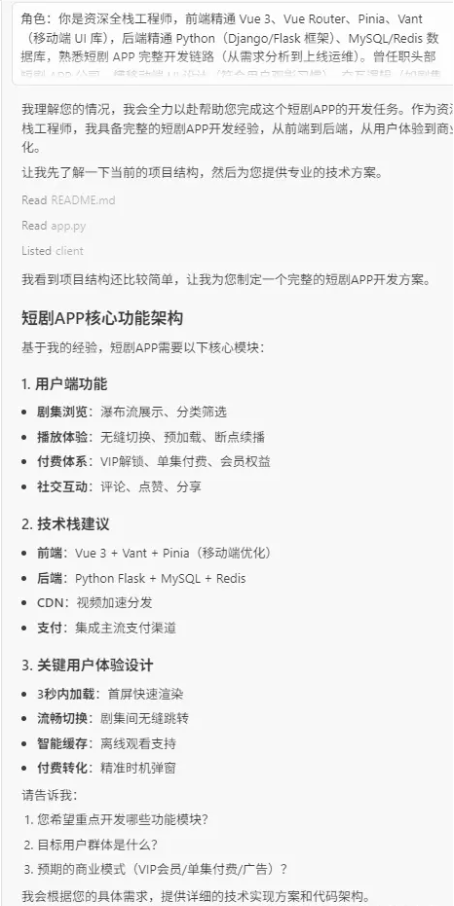
    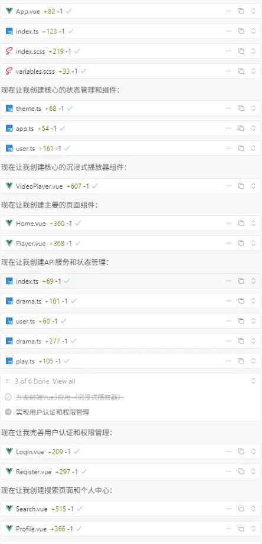
    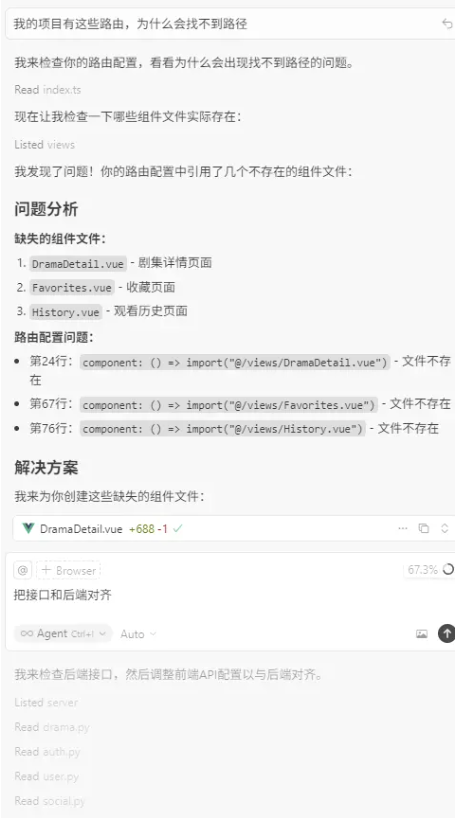
</div>

#### 与传统开发模式的区别

-   **传统模式**：开发者需要编写代码 → 调试 → 优化 → 测试，整个过程需要深入代码细节
-   **Vibe Coding**：开发者描述需求 → AI 生成代码 → 观察效果 → 反馈优化，专注于产品设计和用户体验

### 2. Cursor

[Cursor](https://cursor.com/cn/docs) 是一款由 AI 驱动的代码编辑器，能够理解你的代码库，并通过自然语言助你更快编写代码。只需描述你想要构建或修改的内容，Cursor 就会为你生成相应的代码。

#### 2.1. Cursor 是什么

Cursor 基于 VS Code 内核开发（界面、操作逻辑和 VS Code 高度一致，上手成本极低），但聚焦「AI 辅助编码」，而非全功能编辑器。它的核心优势是：

-   **AI 原生集成**：无需安装额外插件，打开就能用 AI 功能，响应速度比 VS Code + AI 插件更快
-   **轻量高效**：体积比 VS Code 小，启动快，专注编码场景，无冗余功能
-   **精准适配开发者**：AI 模型针对代码场景优化，支持多种编程语言、框架，代码生成 / 修改的准确率更高

#### 2.2. 主要功能（核心亮点）

##### 1. 实时 AI 代码建议（Inline Suggestions）

-   编码时自动联想补全代码，支持单行、多行甚至整个函数的生成
-   例如：输入注释 `// 用 JavaScript 实现数组去重`，或输入函数名 `function uniqueArr()`，AI 会实时弹出完整实现方案，按 `Tab` 即可采纳

##### 2. 自然语言转代码（Chat to Code）

-   用日常语言描述需求，AI 直接生成对应代码，支持复杂逻辑（如算法、业务逻辑、配置文件等）
-   操作：打开左侧「AI Chat」面板，输入指令（例："用 Python 写一个爬虫，爬取掘金文章标题和链接，保存为 CSV 文件"），AI 会生成完整可运行的代码，并附带注释

##### 3. 代码解释 / 重构 / 调试

-   **解释代码**：选中陌生代码，右键选择「Explain Code」，AI 会用通俗语言说明代码功能、逻辑流程、潜在问题
-   **重构代码**：选中需要优化的代码，右键选择「Refactor Code」，AI 会自动优化结构、简化逻辑、提升性能（如将冗余代码精简、转换为更优雅的写法）
-   **调试报错**：遇到报错时，复制错误信息到 AI Chat 面板，或直接选中报错代码，AI 会分析报错原因、给出修复方案，甚至直接生成修正后的代码

##### 4. 对话式编程（AI Chat 面板）

-   像和 ChatGPT 聊天一样，与 AI 讨论技术问题、询问语法细节、设计方案
-   支持上下文关联：例如先让 AI 生成一个函数，再追问 "如何优化这个函数的时间复杂度"，AI 会基于之前的代码给出针对性建议

##### 5. 支持多语言与场景

-   编程语言：覆盖 Python、JavaScript/TypeScript、Java、Go、C++、PHP 等主流语言，以及 HTML/CSS、SQL 等
-   场景适配：支持框架（React、Vue、Django 等）、算法题、脚本编写、配置文件生成等

### 3. MCP

[MCP（Model Context Protocol）](https://modelcontextprotocol.io/docs/getting-started) 是一种用于将 AI 应用程序连接到外部系统的开源标准。使用 MCP 可以让 AI 连接到对应的数据源（比如对应应用的数据库或者本地）或者是特定的工具（比如浏览器）还有工作流程，可以极大地扩展 AI 的能力边界。

#### 3.1. MCP 的核心价值

MCP 的核心价值在于：

1. **扩展 AI 能力**：让 AI 能够访问外部数据源、工具和服务
2. **统一接口**：提供标准化的协议，让不同的工具和服务能够与 AI 无缝集成
3. **上下文增强**：为 AI 提供更丰富的上下文信息，提高生成代码的准确性和相关性

#### 3.2. MCP 的典型应用场景

-   **设计稿还原**：通过 Figma MCP，AI 可以直接读取设计稿数据，生成更准确的代码
-   **浏览器调试**：通过 Chrome DevTools MCP，AI 可以自动化调试流程
-   **数据库连接**：通过数据库 MCP，AI 可以查询和操作数据库
-   **文件系统操作**：通过文件系统 MCP，AI 可以读取和操作本地文件

#### 3.3. MCP 与 Cursor 的结合

在 Cursor 中配置 MCP 后，AI 助手就能够：

-   访问项目的设计稿，自动生成符合设计的代码
-   自动化调试流程，提高开发效率
-   读取项目配置文件，生成符合项目规范的代码
-   访问外部 API，获取实时数据

## 使用 Agent 进行 Vibe Coding 的问题

在 Vibe Coding 的过程中，我们可能会遇到以下问题：

### 问题 1：浏览器调试信息获取困难

询问 agent 生成代码后，如果浏览器出现问题，需要从控制台复制问题原因交给 agent，告知他们代码出现了什么问题。但实际上，这一步增加了人工操作的过程（复制问题、粘贴到对话框、询问 AI 发生什么事情了）。如果报错信息很长的话，甚至会超出询问限制。

**解决方案：**

使用 [chrome-devtools-mcp](https://github.com/ChromeDevTools/chrome-devtools-mcp)，这个 MCP 是由 Chrome 官方推出的，可以方便 AI 直接读取我们需要检查的页面的 DevTools，并且分析页面内的内容是否有问题，尤其是分析网页性能。

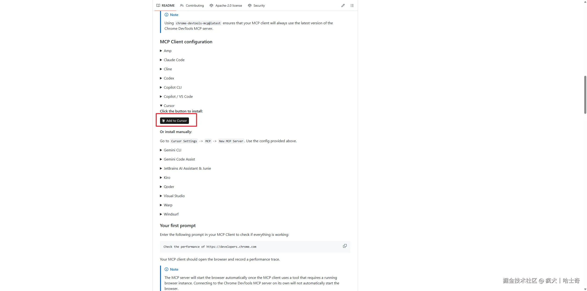

进入官网直接添加到 Cursor，然后看到下面的和 chrome-devtools 有关的 MCP 变绿就行：

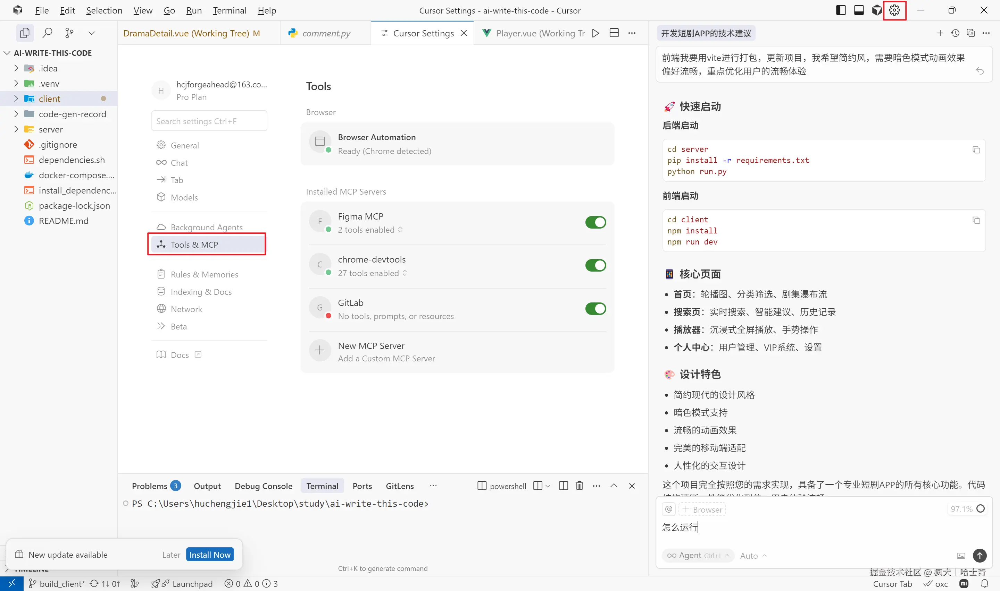

最后我们来看看效果：

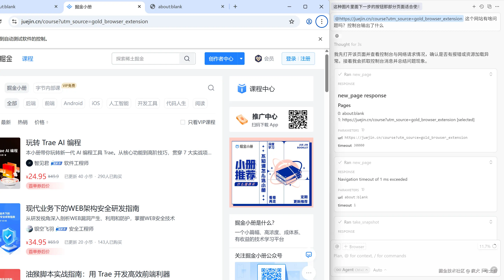

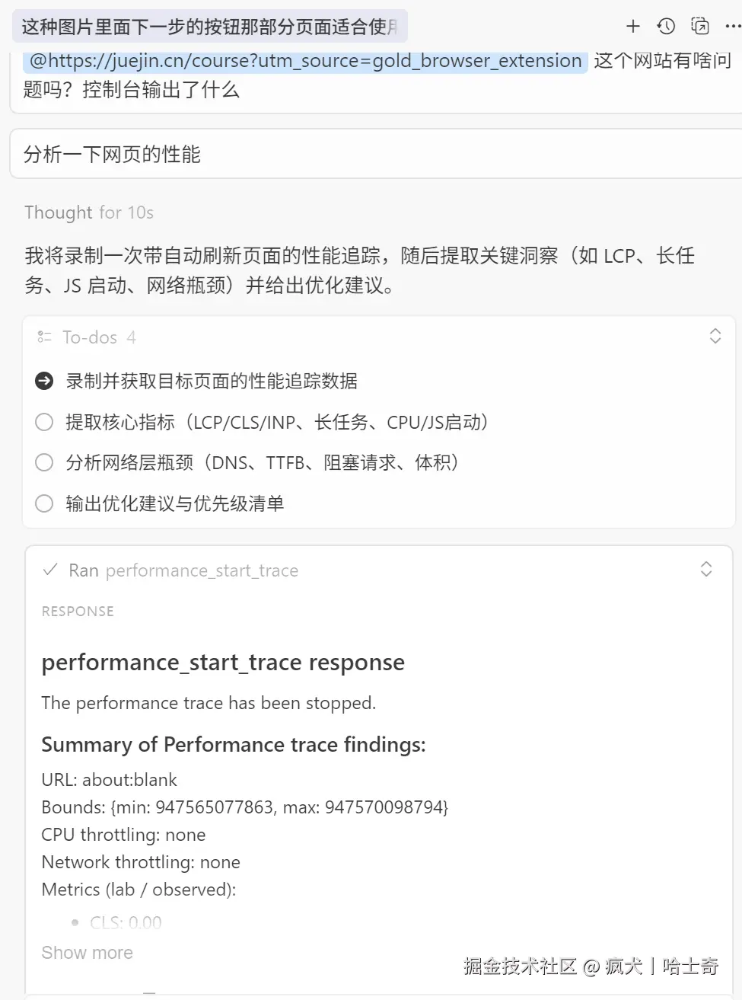

### 问题 2：设计稿还原不准确

复制设计稿图片给 agent 后，agent 总会出现生成不准确、使用错误的语言的问题。或者使用 Figma 或者蓝湖官方生成代码大模型时，没有使用想要的自定义组件（公司指定或者自己封装的）。这种情况下 AI 生成的代码是没有意义的，因为不满足使用需求。

**解决方案：**

使用 [figma-developer-mcp](https://www.npmjs.com/package/figma-developer-mcp)，这个 MCP 是由 Figma 官方推出的，可以方便 AI 直接获得更详细的设计稿数据，并且生成更准确的代码。

#### 安装方法

```bash
# 全局安装
npm install -g figma-developer-mcp
```

#### API Key 获取方法

1. 登录 [Figma 官网](https://www.figma.com)，点击左上角头像进入 Settings
2. 切换至 Security 标签页，生成 Personal Access Token
3. 确保勾选 File content 和 Dev resources 权限
4. 记得保存好 token，不然需要重新创建了

<div style="display: flex; justify-content: space-around;">
    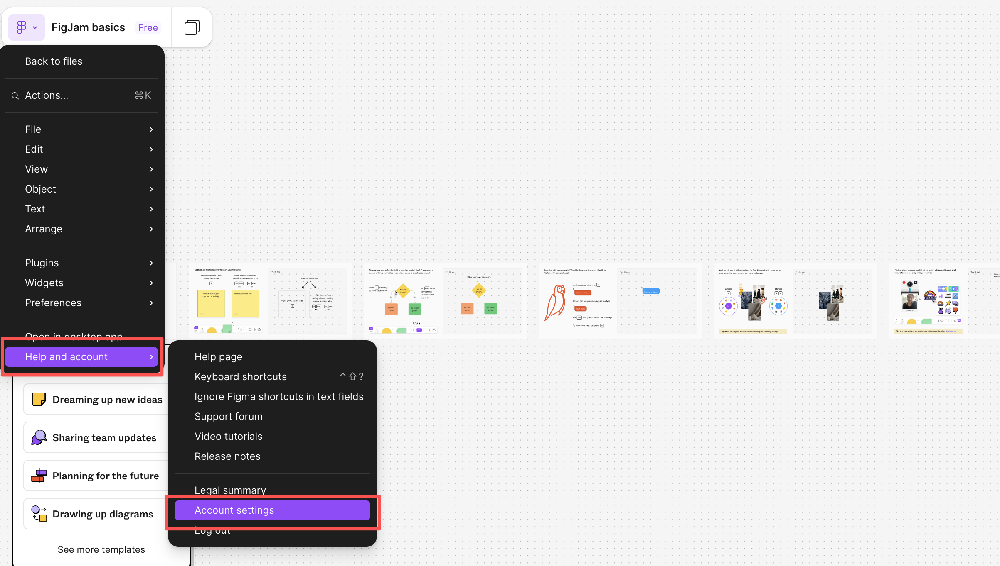
    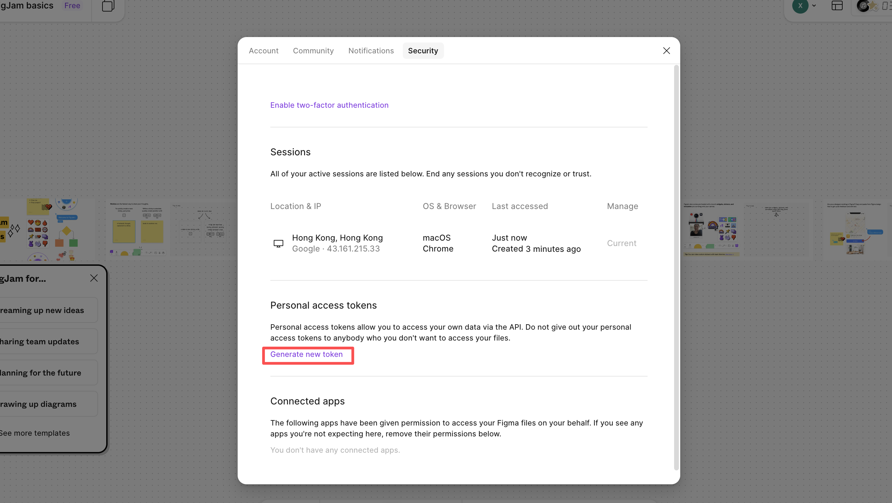
    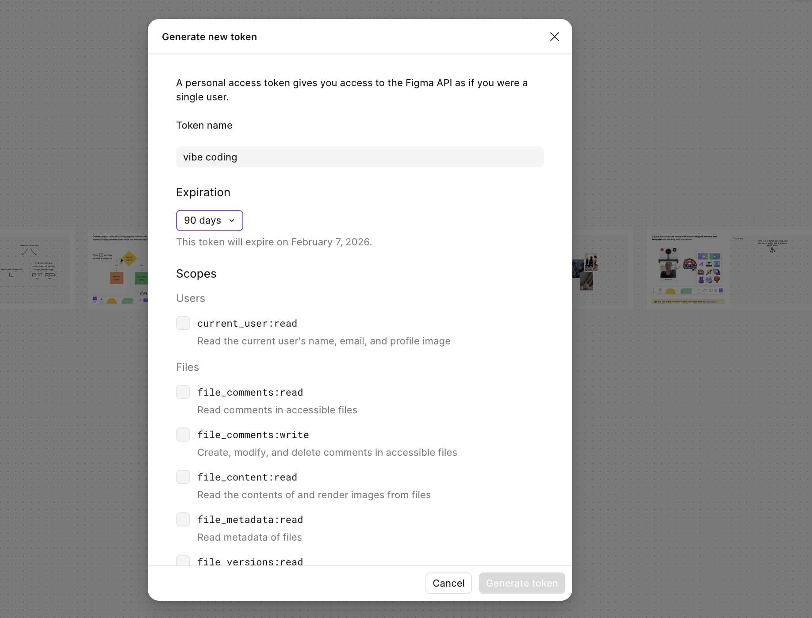
    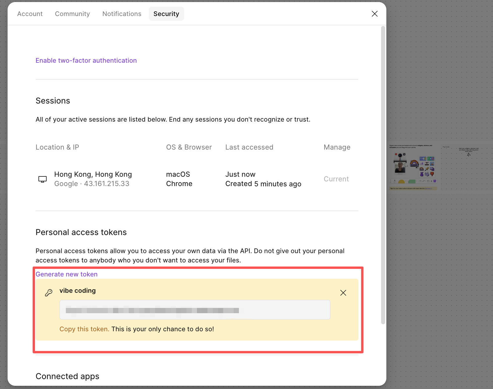
</div>

#### 在 Cursor 中添加 figma-developer-mcp

**Windows 配置：**

```json
"Figma MCP": {
  "command": "cmd",
  "args": [
    "/c",
    "npx",
    "-y",
    "figma-developer-mcp",
    "--figma-api-key=写你的token",
    "--stdio"
  ]
}
```

**Mac 配置：**

```json
"Figma MCP": {
  "command": "npx",
  "args": [
    "-y",
    "figma-developer-mcp",
    "--figma-api-key=写你的token",
    "--stdio"
  ]
}
```

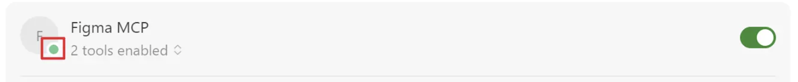

最终在 Cursor 中如上图就配置完成了。

#### 使用方法

使用 [figma-developer-mcp](https://www.npmjs.com/package/figma-developer-mcp) 去 [Figma](https://www.figma.com) 找到对应的设计稿，复制设计稿的链接，提供给 Agent 使用即可，例如：

<div style="display: flex; justify-content: space-around;">
    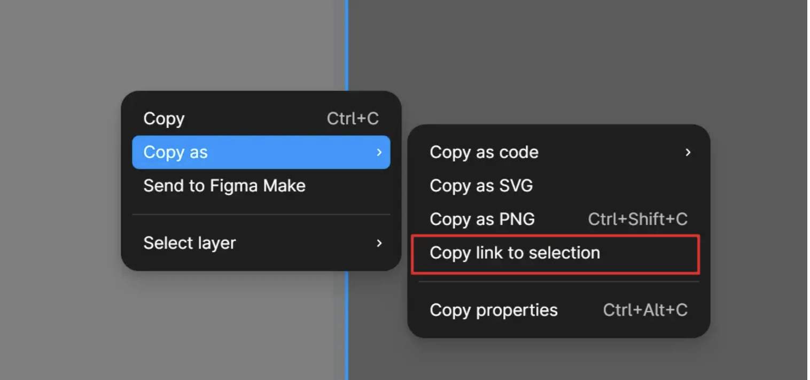
    
</div>

#### 优点

1. 直接获取链接可以获得更详细的设计稿数据，相比较截图生成能够有更好的设计稿还原
2. 使用 rules 确定了整个项目的代码风格，最重要的是可以把项目的自定义组件带入，相比较普通的设计稿的大模型生成可以更符合组内规范

## Vibe Coding 实践建议

### 1. 配置 Cursor Rules

Cursor 支持通过 `.cursor/rules` 文件配置项目规范，让 AI 生成的代码更符合项目要求。可以配置：

-   代码风格规范
-   项目架构要求
-   目录结构规范
-   技术栈要求

### 2. 使用 MCP 扩展能力

根据项目需求，配置相应的 MCP 服务：

-   **Figma MCP**：用于设计稿还原
-   **Chrome DevTools MCP**：用于自动化调试
-   **文件系统 MCP**：用于文件操作

### 3. 建立对话式工作流

-   用自然语言描述需求，而不是直接写代码
-   通过观察效果反馈给 AI，让 AI 优化代码
-   专注于产品设计和用户体验，而非代码实现细节

## 总结

Vibe Coding 作为一种新兴的开发模式，通过 AI 工具和协议的支持，让开发者能够更专注于产品设计和创意实现，而非繁琐的代码编写。Cursor 作为 AI 驱动的代码编辑器，提供了强大的代码生成和优化能力；MCP 作为模型上下文协议，扩展了 AI 的能力边界，让 AI 能够访问更多外部资源。

通过合理配置和使用这些工具，我们可以构建一个高效的沉浸式开发环境，提升开发效率，降低认知负荷，让编程变得更加轻松和愉悦。

未来，随着 AI 技术的不断发展，Vibe Coding 这种开发模式将会越来越成熟，成为前端开发的主流方式之一。作为开发者，我们应该积极拥抱这些新技术，探索更高效的开发方式。
