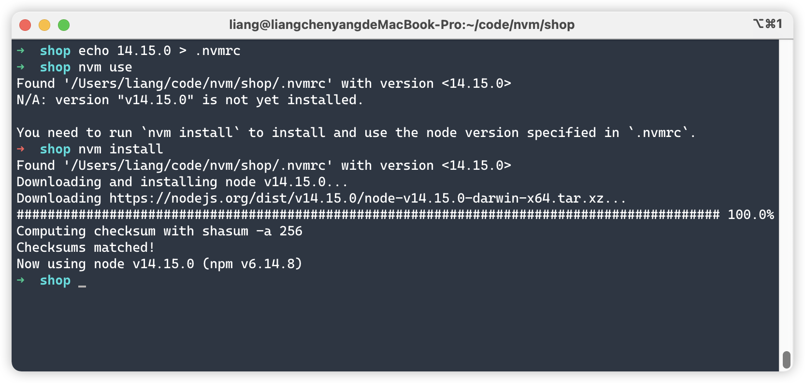

1. ## 前言

  当开发多个项目时，每个项目运行环境要求的 node 版本不一样，那么我们就需要给每个项目指定 node 版本，也就是通过终端执行 nvm install 和 nvm use 命令去安装并切换版本。

​	但是每次都要在终端手动执行命令就很麻烦，特别是项目越来越多的时候，容易忘记切换版本或切换错版本，会导致项目启动不了或运行中有一些错误。

​	这就需要一个管理 node 版本的方法，自动切换 node 版本，这时 .nvmrc 就该上场了

2. ## .nvmrc 是什么

  .nvmrc 的作用：便于切换 node 版本，保证多人开发环境的一致性

​	.nvmrc 是一个文件，文件内容非常简单，只有一个 nvm 可识别的 node 版本文本内容，比如: v12.18.2，这个文件应该放在项目根目录下，并且不应被 git 忽略

3. ## 创建 .nvmrc 文件

  打开终端，进入项目根目录执行以下命令，使用 nvm 可识别的版本号格式即可：

​	以下命令会将字符串填入指向的文件中并创建，当文件存在时，则会对文件进行重写

    echo "12.18.2" > .nvmrc
    echo "v12.18.2" > .nvmrc
    echo "lts/fermium" > .nvmrc
4. ## 使用 .nvmrc 文件

  在有 .nvmrc 文件的目录执行以下命令，会读取并尝试切换 .nvmrc 中的 node 版本

​	该命令会从当前目录向上遍历目录结构寻找 .nvmrc 文件，在带有 .nvmrc 的目录的任何子目录运行该命令都会起作用

```
nvm use
```

​	如果 .nvmrc 中的 node 版本已安装，当前终端窗口的 node 将自动切换为该版本


​	如果 .nvmrc 中的 node 版本没有安装，将会出现以下提示

```shell
N/A: version "v14.15.0" is not yet installed.
You need to run `nvm install` to install and use the node version specified in `.nvmrc`.

#不适用：版本 v14.15.0 尚未安装
#您需要运行 nvm install 来安装并使用 .nvmrc 中指定的 node 版本
```

接下来使用以下命令，nvm install 不带参数时会从 .nvmrc 中读取 node 版本，如果该 node 版本没有安装，将自动进行下载，下载好后会将当前窗口的 node 切换为此版本。如果该版本已经安装，会跳过下载，只将当前窗口的 node 切换

```shell
nvm install
```




5. ## 终端自动切换版本

  当使用 nvm use 切换版本仍然觉得麻烦，想要打开终端自动切换 node 版本，也可以实现

​	zsh 终端根据 .nvmrc 文件自动切换 node 版本：

​	在 $HOME/.zshrc 中添加以下代码后，每次进入一个包含 .nvmrc 文件的目录时自动调用 nvm use

```
# 温馨提示: 将其放在 nvm 初始化之后

# nvm 根据 .nvmrc 自动切换 node 版本

autoload -U add-zsh-hook
load-nvmrc() {
local nvmrc_path="$(nvm_find_nvmrc)"
if [ -n "$nvmrc_path" ]; then
local nvmrc_node_version=$(nvm version "$(cat "${nvmrc_path}")")
if [ "$nvmrc_node_version" = "N/A" ]; then
nvm install
elif [ "$nvmrc_node_version" != "$(nvm version)" ]; then
nvm use
fi
elif [ -n "$(PWD=$OLDPWD nvm_find_nvmrc)" ] && [ "$(nvm version)" != "$(nvm version default)" ]; then
echo "Reverting to nvm default version"
nvm use default
fi
}
add-zsh-hook chpwd load-nvmrc
load-nvmrc
```

​	编辑好 .zshrc 文件后，执行以下命令使其立即生效

```
source ~/.zshrc
```

​	效果如下所示，进入一个含有 .nvmrc 文件的目录会自动切换当前窗口的 node 版本，退出目录时自动切换为默认 node 版本


