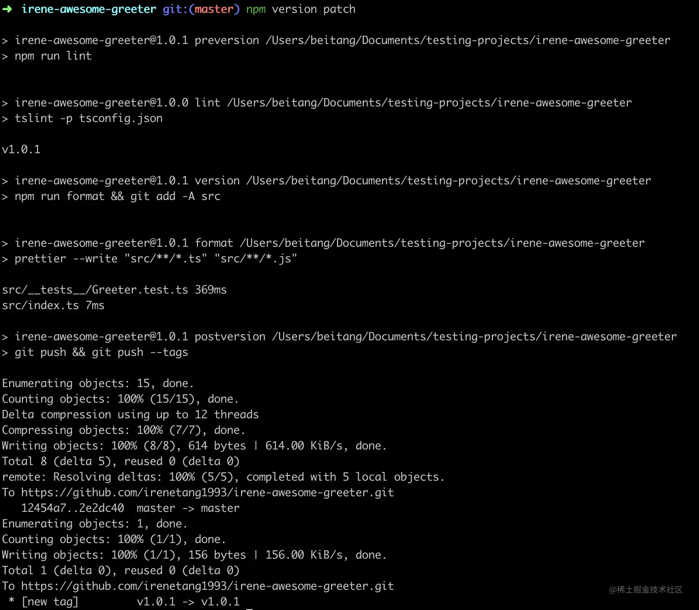

### 前提

- 下载 Node.js 和 NPM。

  ```arduino
  node -v 
  npm -v 
  ```

- 选一个好的包名。包名必须是 pascal-case 并且全部小写。因为 NPM 上有 700k+ 的包，所以你需要在构建之前先去 [www.npmjs.com/](https://link.juejin.cn?target=https%3A%2F%2Fwww.npmjs.com%2F) 查询你的包名有没有被使用。在本文中，我取了 irene-awesome-gretter。

### 基本构建

- 选择一个合适的名字创建包文件夹。

  ```bash
  mkdir irene-awesome-greeter && cd irene-awesome-greeter
  ```

- 新建 

  ```
  .gitignore
  ```

   文件并写入 node_modules，新建 

  ```
  README
  ```

   文件。

  ```bash
  echo "node_modules" >> .gitignore
  echo "# Irene Awesome Greeter" >> README.md
  ```

- Git 初始化包并关联远程仓库。下面 Git Repository Url 是远程仓库的 Url。

  ```csharp
  git init
  git add . && git commit -m "Initial commit"
  git remote add origin <Git Repository Url>
  git push -u origin master
  ```

- NPM 初始化包，后续我们会修改生成的 

  ```
  package.json
  ```

  ```csharp
  npm init -y
  ```

  至此，生成的目录结构如下：

  

### 添加 TypeScript as devDependencies

- 下载 TypeScript。

  ```css
  npm i -D typescript
  ```

  下载完后，在根目录下多了 `node_modules` 文件夹和 `package-lock.json` 文件。

- 为了编译 `TypeScript`，我们需要一个配置文件，在根目录下新建 `tsconfig.json`，内容如下。⚠️注意我（译者）在原文配置的基础上添加了 lib，指定了 es6，原因见 - [详情](https://juejin.cn/post/6844903892094812173)。

  ```json
  {
    "compilerOptions": {
      "target": "es5",
      "module": "commonjs",
      "declaration": true,
      "outDir": "./lib",
      "strict": true，
      "lib": ["es6"]
    },
    "include": ["src"],
    "exclude": ["node_modules", "**/__tests__/*"]
  }
  ```

  

  

  下面解释下配置文件字段：注意 ES6 = ES2015

  

  - target：编译之后生成的 `JavaScript` 文件需要遵循的标准，可选值：`"ES3"（默认），"ES5"，"ES6"/"ES2015"，"ES2016"，"ES2017"或"ESNext"`。我们选择了 `es5` 为了使包具有更好的浏览器兼容性。

  - module：指定生成哪个模块系统代码，默认值：`target === "ES3" or "ES5" ? "CommonJS" : "ES6"`。

  - declaration：是否生成对应的声明文件，默认值：false。在构建包时，应该设置为 true，这样 `TypeScript` 会将生成的声明文件和对应编译后的 `JavaScript` 代码一起导出，以便包可以在 `TypeScript` 和 `JavaScript` 项目中同时使用。本项目中生成的声明文件是 /lib/index.d.ts。

  - outDir：指定输出目录。编译后的 `JavaScript` 代码会在与 `tsconfig.json` 同级的 lib 文件夹中。

  - strict：是否启用所有严格类型检查选项，默认值：false。

  - lib：编译需要的库文件，例如你指定的 target 是 

    ```
    ES5
    ```

    ，但是在代码中使用了 

    ```
    ES6
    ```

     特性，就需要在 lib 中加上 ES6。默认值：如果 lib 没有指定默认注入的库的列表，默认注入的库为：

    - target ES5：DOM，ES5，ScriptHost。
    - target ES6：DOM，ES6，DOM.Iterable，ScriptHost。

  - include：指定要编译的目录。

  - exclude：指定不编译的目录。`node_modules` 和 `__tests__` 只是在开发阶段使用，构建阶段无需编译。

  更多的编译选项可参考 [www.typescriptlang.org/docs/handbo…](https://link.juejin.cn?target=https%3A%2F%2Fwww.typescriptlang.org%2Fdocs%2Fhandbook%2Fcompiler-options.html)

- 创建 `src` 文件夹，在其下新建一个 index.ts，内容如下：

  ```typescript
  export const Greeter = (name: string) => `Hello ${name}`;
  ```

- 在 `package.json` 中添加 build script。

  ```json
  "build": "tsc"
  ```

  

  

  在控制台运行 npm run build，你会看到生成了一个新的 lib 文件夹，里面是编译后的 js 代码和声明文件。

  

  

- 除了 `package-lock.json` 以外， 我们一般都不希望提交自动生成的文件到 Git 上去，因为只要改变了源文件，每次 build 的时候它们都不同，就会造成很多冲突，所以我们把 lib 文件夹放到 `.gitignore` 中。

  ```bash
  node_modules
  /lib
  复制代码
  ```

### Formatting & Linting

- 下载 

  ```
  prettier tslint tslint-config-prettier
  ```

  和 

  ```
  TypeScript
  ```

   一样，它们只是在包开发阶段所需的工具，所以是 devDependencies。

  ```arduino
  npm i -D prettier tslint tslint-config-prettier
  ```

  一个好的包应该包括严格的代码规范，尤其是有其他协作者共同开发时。

  ```
  tslint-config-prettier
  ```

   能防止 

  ```
  TSLint
  ```

   和 

  ```
  Prettier
  ```

   格式化规则的冲突。

- 在根目录下，新建 

  ```
  tslint.json
  ```

  ，添加如下内容：

  ```json
  {
    "extends": ["tslint:recommended", "tslint-config-prettier"]
  }
  ```

- 在根目录下，新建 

  ```
  .prettierrc
  ```

  ，添加如下内容：

  ```json
  {
    "printWidth": 120,
    "trailingComma": "all",
    "singleQuote": true
  }
  ```

- 最后，在 

  ```
  package.json
  ```

   中添加 lint 和 format script。

  ```sql
  "format": "prettier --write \"src/**/*.ts\" \"src/**/*.js\"",
  "lint": "tslint -p tsconfig.json"
  ```

  现在，你的 

  ```
  package.json
  ```

   应该长这样：

  

  在控制台运行 npm run lint / npm run format

  ```arduino
  npm run lint
  npm run format
  ```

  

### 移除不必要文件

在 `.gitignore` 中，我们添加 /lib 是因为不想 Git 远程仓库中有编译后的文件，但对于要发布的包则恰恰相反，我们不要源代码，只需要编译后的文件！有两种方式可以实现：

- 黑名单：新建一个 

  ```
  .npmignore
  ```

   文件，在其中添加不要的文件（夹）。

  ```css
  src
  tsconfig.json
  tslint.json
  .prettierrc
  ```

  但是，这并不是一个好的实践，因为根目录下每次新增加一个文件（夹）都需要添加到 

  ```
  .npmignore
  ```

   中，于是有了下面这种方式。

- 白名单：在 

  ```
  package.json
  ```

   中设置一个要发布的文件（夹）白名单

  ```json
  "files": ["lib/**/*"]
  ```

  就是这么的简单！只有 lib 文件夹会出现在发布的包里（README.md 和 package.json 会被默认添加）。更多关于黑名单 VS 白名单的内容可以参考 

  blog.npmjs.org/post/165769…

### Jest Testing

一个好的包应该要包括单元测试。接下来，我们添加 Jest —— Facebook 开发的一个非常棒的测试框架。

- 因为我们是针对 ts 源文件编写测试用例，所以除了 

  ```
  jest
  ```

   还需要 

  ```
  ts-jest @types/jest
  ```

  ，它们只是在开发阶段需要，所以添加到 devDependencies。

  ```css
  npm i -D jest ts-jest @types/jest
  ```

- 配置 Jest。有两种方式，在 

  ```
  package.json
  ```

   添加 "jest" 字段 或者 新建一个单独的配置文件。我们选择后者，因为前者配置内容会被添加到发布的包中而后者不会。新建 

  ```
  jestconfig.json
  ```

  ，添加如下内容：

  ```swift
  {
    "transform": {
      "^.+\\.(t|j)sx?$": "ts-jest"
    },
    "testRegex": "(/__tests__/.*|(\\.|/)(test|spec))\\.(jsx?|tsx?)$",
    "moduleFileExtensions": ["ts", "tsx", "js", "jsx", "json", "node"]
  }
  ```

  移除 

  ```
  package.json
  ```

   中的 "test" script，添加一个新的 test script。

  ```json
  "test": "jest --config jestconfig.json"
  ```

  现在，你的 

  ```
  package.json
  ```

   长下面这样：

  

### 写一个测试用例

是时候写一个测试用例了。在 `src` 目录下，新建一个 `__tests__` 文件夹，在其中新建一个测试文件，文件名必须以 `test.ts` 结尾，例如：Greeter.test.ts。

```javascript
import { Greeter } from '../index';
test('My Greeter', () => {
  expect(Greeter('Carl')).toBe('Hello Carl');
});
```

这个测试用例验证了当输入 'Carl' 的时候，Greeter 方法是否返回 'Hello Carl'。 接下来我们运行一下

```arduino
npm run test
```


运行成功！可以看到测试用例通过了。


### scripts in NPM

一个好的包应该尽可能自动化。接下来，我们来看看 NPM 中其他的 scripts：`prepare，prepublishOnly，perversion，version，postversion`。

- prepare：会在打包和发布包之前以及本地 

  ```
  npm install
  ```

   （不带任何参数）时运行。

  ```json
  "prepare": "npm run build"
  ```

- prepublishOnly：在 

  ```
  prepare
  ```

   script 之前运行，并且仅在 

  ```
  npm publish
  ```

   运行。在这里，我们可以运行 

  ```
  npm run test & npm run lint
  ```

   以确保我们不会发布错误的不规范的代码。

  ```json
  "prepublishOnly": "npm run test && npm run lint"
  ```

- preversion：在发布新版本包之前运行，为了更加确保新版本包的代码规范，我们可以在此运行 

  ```
  npm run lint
  ```

  。

  ```json
  "preversion": "npm run lint"
  ```

- version：在发布新版本包之后运行。如果您的包有关联远程 Git 仓库，像我们的情况一样，每次发布新版本时都会生成一个提交和一个新的版本标记，那么就可以在此添加规范代码的命令。又因为 

  ```
  version
  ```

   script 在  

  ```
  git commit
  ```

   之前运行，所以还可以在此添加 

  ```
  git add
  ```

  。

  ```json
  "version": "npm run format && git add -A src"
  ```

- postversion：在发布新版本包之后运行，在 

  ```
  git commit
  ```

  之后运行，所以非常适合推送。

  ```json
  "postversion": "git push && git push --tags"
  ```

截至目前，我们的 NPM scripts 长下面这样：

```sql
"scripts": {
  "test": "jest --config jestconfig.json",
  "build": "tsc",
  "format": "prettier --write \"src/**/*.ts\" \"src/**/*.js\"",
  "lint": "tslint -p tsconfig.json",
  "prepare": "npm run build",
  "prepublishOnly": "npm run test && npm run lint",
  "preversion": "npm run lint",
  "version": "npm run format && git add -A src",
  "postversion": "git push && git push --tags"
}
```

### 终极版 package.json

```swift
{
  "name": "irene-awesome-greeter",
  "version": "1.0.0",
  "description": "A nice greeter", // 
  "main": "lib/index.js", // 
  "types": "lib/index.d.ts", // 
  "scripts": {
    "test": "jest --config jestconfig.json",
    "build": "tsc",
    "format": "prettier --write \"src/**/*.ts\" \"src/**/*.js\"",
    "lint": "tslint -p tsconfig.json",
    "prepare": "npm run build",
    "prepublishOnly": "npm run test && npm run lint",
    "preversion": "npm run lint",
    "version": "npm run format && git add -A src",
    "postversion": "git push && git push --tags"
  },
  "repository": {
    "type": "git",
    "url": "git+https://github.com/irenetang1993/irene-awesome-greeter.git"
  },
  "keywords": ["Hello", "Greeter"], // 
  "author": "Irene Tang", // 
  "license": "ISC",
  "bugs": {
    "url": "https://github.com/irenetang1993/irene-awesome-greeter/issues"
  },
  "homepage": "https://github.com/irenetang1993/irene-awesome-greeter#readme",
  "devDependencies": {
    "@types/jest": "^24.0.15",
    "jest": "^24.8.0",
    "prettier": "^1.18.2",
    "ts-jest": "^24.0.2",
    "tslint": "^5.18.0",
    "tslint-config-prettier": "^1.18.0",
    "typescript": "^3.5.2"
  },
  "files": [
    "lib/**/*"
  ]
}
```

我们完善了 description，author，keywords 信息，修改了 `main`，新增了 `types`。 `main` 字段非常重要，因为指明了模块的入口。`types` 字段指明了声明文件的入口。

### 提交并推送到 Git

```sql
git add -A && git commit -m "Setup Package"
git push
```

### 发布

在发布之前，如果你没有 NPM 账号的话，必须先注册一个。你可以在 [www.npmjs.com/signup](https://link.juejin.cn?target=https%3A%2F%2Fwww.npmjs.com%2Fsignup) 上注册或者通过运行 `npm adduser` 注册。如果你已经有账号了，运行 `npm login` 登陆你的 NPM 账号。

```text
npm whoami
```

显示出了自己的用户名就算登录成功了


好了！现在你可以发布了。

```
npm publish
```

可以看到，先运行 `prepare` script，在其中运行了 `npm run build`，然后运行 `prepublishOnly` script，在其中运行了 `npm run test && npm run lint`。


### 查看你的发布

现在，你可以去 NPM 上查看你刚刚发布的包。URL 是 `https://npmjs.com/package/<your-package-name>`，我发布的包就是 [npmjs.com/package/ire…](https://link.juejin.cn?target=https%3A%2F%2Fnpmjs.com%2Fpackage%2Firene-awesome-greeter)


### 创建一个新版本

执行如下命令会创建一个新版本， `preversion，version，postversion` scripts 会被执行：创建一个新的 tag 并且推送到我们的远程仓库。

```
npm version patch
```





我们再发布一次：

```
npm publish
```

现在，我们的包就有了一个 1.0.1 的版本：


### 如何撤销发布的包

终端执行 npm unpublish 例如：

 1、npm unpublish <your-package-name>@1.0.0 删除某个版本 

 2、npm unpublish <your-package-name> --force 删除整个npm市场的包

不过撤包推荐用法： npm unpublish的推荐替代命令：npm deprecate [@] 使用这个命令，并不会在社区里撤销你已有的包，但会在任何人尝试安装这个包的时候得到警告 例如：npm deprecate z-tool '这个包我已经不再维护了哟～'

【注意】如果报权限方面的错，加上--force


### 发布错误集锦

1、需要提高版本号

```text
#1、发包 npm publish 失败
sh-neverleave:z-tool neverleave$ npm publish
npm ERR! publish Failed PUT 400
npm ERR! code E400
npm ERR! deprecations must be strings : z-tool

npm ERR! A complete log of this run can be found in:
npm ERR!     /Users/neverleave/.npm/_logs/2018-11-23T10_52_01_742Z-debug.log
sh-neverleave:z-tool neverleave$ npm publish


#2、发包 npm publish 失败
sh-neverleave:z-tool neverleave$ npm publish
npm ERR! publish Failed PUT 403
npm ERR! code E403
npm ERR! You cannot publish over the previously published versions: 1.0.3. : z-tool

npm ERR! A complete log of this run can be found in:
npm ERR!     /Users/neverleave/.npm/_logs/2018-11-23T11_24_57_662Z-debug.log
sh-neverleave:z-tool neverleave$
```

2、发包 npm publish 失败 解决方案：终端执行： npm publish --access public

参考：[https://stackoverflow.com/questions/53420758/npm-publish-gives-unscoped-packages-cannot-be-private](https://link.zhihu.com/?target=https%3A//stackoverflow.com/questions/53420758/npm-publish-gives-unscoped-packages-cannot-be-private)

```text
#1、发包 npm publish 失败
sh-neverleave:npm neverleave$ npm publish
npm ERR! publish Failed PUT 400
npm ERR! code E400
npm ERR! unscoped packages cannot be private : z-tool

npm ERR! A complete log of this run can be found in:
npm ERR!     /Users/neverleave/.npm/_logs/2018-11-23T08_44_21_310Z-debug.log
sh-neverleave:npm neverleave$ 

#解决方案：终端执行： npm publish --access public
sh-neverleave:npm neverleave$ npm publish --access public
+ z-tool@1.0.0
sh-neverleave:npm neverleave$
```

3、确保登录的用户账号正确

```text
sh-neverleave:npm neverleave$ npm publish
npm ERR! publish Failed PUT 404
npm ERR! code E404
npm ERR! 404 User not found : z-tool
npm ERR! 404 
npm ERR! 404  'z-tool' is not in the npm registry.
npm ERR! 404 You should bug the author to publish it (or use the name yourself!)
npm ERR! 404 
npm ERR! 404 Note that you can also install from a
npm ERR! 404 tarball, folder, http url, or git url.

npm ERR! A complete log of this run can be found in:
npm ERR!     /Users/neverleave/.npm/_logs/2018-11-23T07_32_28_518Z-debug.log
```

4、登录时需要在username 前加‘~’，具体大家可以验证

```text
sh-neverleave:npm neverleave$ npm login
Username: (~neverleave) neverleave
Password: (<default hidden>) 
Email: (this IS public) (1063588359@qq.com) 
npm ERR! code EAUTHIP
npm ERR! Unable to authenticate, need: Basic

npm ERR! A complete log of this run can be found in:
npm ERR!     /Users/neverleave/.npm/_logs/2018-11-23T07_27_50_877Z-debug.log
sh-neverleave:npm neverleave$
```

5、无权限删除线上的包（撤包有时间限制，24小时） 解决方案：加上 --force

```text
sh-neverleave:z-tool neverleave$ npm unpublish z-tool
npm ERR! Refusing to delete entire project.
npm ERR! Run with --force to do this.
npm ERR! npm unpublish [<@scope>/]<pkg>[@<version>]
sh-neverleave:z-tool neverleave$ 

#解决方案（内部有被鄙视的话，  I sure hope you know what you are doing.）
sh-neverleave:z-tool neverleave$ npm unpublish z-tool --force
npm WARN using --force I sure hope you know what you are doing.
- z-tool
sh-neverleave:z-tool neverleave$
```

6、删除npm市场的包同名的24小时后才能重新发布

```text
sh-neverleave:z-tool neverleave$ npm publish
npm ERR! publish Failed PUT 403
npm ERR! code E403
npm ERR! z-tool cannot be republished until 24 hours have passed. : z-tool

npm ERR! A complete log of this run can be found in:
npm ERR!     /Users/neverleave/.npm/_logs/2018-11-23T11_41_24_086Z-debug.log
sh-neverleave:z-tool neverleave$
```

完结.... 
